# EE 4363 / CSci 4203 — Complete Consolidated Reference

**Course:** Computer Architecture & Machine Organization  
**Instructor (slides):** Ulya Karpuzcu  

**How to use this document.** This is a **single self-contained** reference. If you understand **§1–8**, you have the ideas, formulas, and worked patterns needed for typical exam questions on: **Lecture 4** (single-cycle MIPS), **Lectures 5–7** (pipelining, hazards, forwarding, branches, prediction), **Lecture 8** (caches, AMAT, VM/TLB/VIPT, PIM), and **discussion-style problems** in **§7** (shift vs multiply, add-and-shift multiply, **TIMS** vs MIPS, forwarding **matrix**, **M/MR** formats). **§9** is optional **Mermaid** structure diagrams (datapath, pipeline, memory, predictors) to visualize what **§1–8** state in prose. **§10** is a one-page **master** checklist; **§11** repeats high-yield bullets and per-lecture exam checklists. **Nothing outside this file is required** to learn from it—cross-references are **only to other sections of this same document** (e.g. **§3.6**, **§5.14**).

**Coverage map:** **§2** = Lecture 4 · **§3–5** = Lectures 5–7 · **§6** = Lecture 8 · **§7** = discussion handout topics (TIMS, matrix, M/MR) · **§8** = exam problem archetypes and index-style tables · **§9** = diagrams · **§10–11** = checklists and H&P **textbook** chapter pointers (book names, not local files).

**Scope limits.** (1) **Lectures 1–3** (early ISA) are not developed here; **§7** gives **illustrative** MIPS and TIMS for array-style access where a handout might ask for a full C comparison—substitute the C your instructor provides. (2) **Bitmap-only** figures in live slides are not reproducible in text; this file gives the **same concepts** in words, tables, and **§9** block diagrams. If a number or field width is ambiguous on an exam, use the definition stated **in the problem** and the methods in **§2–6**.

---

## 1. Global defaults and exam conventions

Unless a problem states otherwise, align with in-class **five-stage MIPS** and discussion handouts:

- **Pipeline stages:** IF → ID → EX → MEM → WB.
- **Branches resolved in ID** (register compare and branch target in ID).
- **No branch prediction** when analyzing hazards unless the problem gives a policy (e.g. predict not taken, 2-bit table, BTB).

These defaults match **Lectures 5–7** and the **discussion** handout assumptions. On **pipeline** problems, mark **stalls**, **bubbles**, and **flushes** explicitly when drawing space–time charts (Lect05 sets this expectation; Lect07 shows squashed-instruction stories).

### 1.1 General context (lighter-depth exam glue)

These items are **exam vocabulary** and **cross-topic glue**; deeper treatment appears in the parts below.

- **Brainiac vs speed daemon / complexity-effective design:** see **§3.1** (high IPC and extra hardware vs high frequency and a simpler stage; wire delay on bypass/issue paths limits \(T_c\)).
- **Software “flat” memory vs hardware hierarchy:** the program often reasons about one large VA space; the machine implements **registers → caches → DRAM → storage** to exploit **locality** (**§6.1**).
- **I-cache miss vs D-cache miss:** an **instruction** miss delays **IF** (refetch / replay of fetch); a **data** miss delays the **load or store in MEM** (or equivalent) until the line arrives. Both inflate **CPI** via **stalls**; **split I$/D$** (structural-hazard story in **§3.6**; **§2.1** single-cycle; weighted **I$/D$** models in **§6.9**) avoids **one-ported memory** for IF+MEM and separates **fetch vs data** traffic.
- **Earliest restart** / **critical word first (§6.4):** microarchitectural ways to start execution before the **entire** cache line has arrived on a long miss, reducing exposed miss penalty.
- **Static branch heuristics without tables:** e.g. **backward branches** (loops) **often taken**, **forward branches** (if-style) **often not taken**—cheap policy when full **BHT/BTB** is not in scope (**§3.6**, **§5.9**).
- **OS role on page fault:** the **OS** runs the fault handler, picks **victim** frames, and updates **page tables**; this differs from **cache** replacement, which is usually **hardware-driven** in simpler models (**§6.12**).
- **VIPT and aliases:** the **index-within-page** constraint and **page coloring** when associativity×index would otherwise exceed the **offset** shared by VA and PA are summarized in **§6.13**.

---

## 2. Part A — From ISA to single-cycle microarchitecture (Lecture 4)

### 2.1 ISA vs microarchitecture

- **Instruction Set Architecture (ISA):** programmer-visible contract—encodings, meaning of each instruction, register conventions, memory model.
- **Microarchitecture:** how the ISA is implemented in hardware—**datapath** (ALU, register file, memories, adders, muxes) and **control** (combinational logic from opcode / `funct` to RegWrite, memory controls, ALU function selects).
- Lecture 4’s baseline is **single clock cycle (non-pipelined):** every instruction completes in one cycle; **clock period** must cover the **slowest (critical-path) instruction**, which the slides identify as a **load word** (`lw`).

**Textbook alignment:** Hennessy & Patterson, *Computer Organization and Design* (or *COD*), **Chapter III**, sections **III.I–III.IV** (addressing, single-cycle datapath, control, critical path).

### 2.2 Addressing modes (summary table from lecture)

| Concept | MIPS usage in the single-cycle design |
|--------|----------------------------------------|
| **Register** | R-type: ALU inputs from `rs`, `rt`; R-type `rd` destination. |
| **Base + displacement (16-bit signed)** | `lw` / `sw`: effective address = `R[rs] + sign_ext(imm16)`. |
| **PC-relative** | `beq`: target = (PC+4) + (sign_ext(offset16) << 2). |
| **Jump (pseudo-direct)** | `j` / `jal`: `{ PC+4[31:28], address26, 2'b0 }` (26-bit field is a **word** address). |

Byte addressing and **word alignment** (addresses divisible by 4) are implicit in PC+4 and branch shift-by-2.

### 2.3 Instruction life-cycle (logical phases in one long cycle)

1. **Fetch:** use **PC** to read **instruction memory**.
2. **Decode:** interpret opcode, register specifiers, immediates, `funct` for R-type; determine resources; read operands (e.g. `rs`/`rt` → register file).
3. **Execute:** R-type ALU per `funct`; load/store address = `R[rs] + sign_ext(imm)`; branch target = PC+4 + shifted displacement; for branches, ALU compare (e.g. subtract for `beq`, use **Zero**).
4. **Memory (if load/store):** load reads D-mem; store writes `R[rt]`.
5. **Write-back (if required):** R-type `rd`, or `rt` for `lw`.
6. **Update PC:** PC+4, or branch target if taken, or jump target for `j`/`jal`.

**Design choice:** **Harvard-style split** in the full datapath: separate **I-memory** and **D-memory** (or I$ / D$ in real systems).

### 2.4 Logic design vocabulary

- **Binary:** information on wires; **buses** for multi-bit paths.
- **Combinational elements:** output is function of current inputs—AND, **2:1 mux** \(Y = S ? I1 : I0\), **adder**, **ALU** with ALU control.
- **Sequential elements:** state—**D flip-flop**; edge-triggered **Q** ← **D** on clock; **PC** holds state between cycles. Single-cycle still uses the principle that the **longest** combinational path (plus register setup) sets the minimum period (**clocking methodology**).
- **Multiplexers** merge parallel stories (ALU B from `rt` vs sign-extended immediate; write-back from ALU vs memory).

### 2.5 Per-instruction class behavior

**Instruction fetch (IF):** PC is 32-bit byte address of current instruction; next sequential is **PC+4**; I-mem read → 32-bit instruction word to decode/control.

**R-format:** read `R[rs]`, `R[rt]`; ALU from `funct` (via ALU control); write **`R[rd]`** when **RegWrite**; **RegDst** selects `rd` (vs `rt` for loads). Fields: `op` (0 for R-type), `rs`, `rt`, `rd`, `shamt`, `funct`.

**Load / store (I-type layout: op[31:26], rs, rt, imm[15:0]):** sign-extend immediate; **ALU add** for address. **`lw` (op 35):** **MemRead**, data to write-back mux, **MemtoReg=1**, **RegWrite** to **`R[rt]`**. **`sw` (op 43):** **MemWrite**, **RegWrite=0**, write data = **`R[rt]`**.

**Branch `beq` (op 4):** read `R[rs]`, `R[rt]`; **ALU subtract**; **Zero** for equality; sign-extend offset, **<< 2**, add to **PC+4**; **Branch** AND **Zero** selects target vs fall-through. Slide note: sign extension is **wiring** (replicate sign bit).

**Putting it together:** each datapath element does one op per “slot” in the single-cycle model, but a new instruction each cycle time-multiplexes through **shared** hardware via **muxes**. Because **fetch** and **load/store** both need memory access, **separate I- and D-memories** and muxing are required (slides ~43–50).

**J-type (`j`, op 2):** `address[25:0]` is 26-bit **word** address; next PC = **PC+4[31:28] ‖ address ‖ 00**; **`Jump`** mux selects vs branch/sequential (slide “Datapath With Jumps Added”).

### 2.6 ALU control and main control

**ALU control bits → operation (examples from slides):**

| ALU control | Operation |
|-------------|-----------|
| 0000 | AND |
| 0001 | OR |
| 0010 | add |
| 0110 | subtract |
| 0111 | set-on-less-than |

**2-bit `ALUOp` from main control** narrows class; e.g. `10` = use `funct` for R-type.

| Instruction class | `ALUOp` | `funct` | Resulting ALU action |
|-------------------|---------|---------|----------------------|
| `lw`, `sw` | 00 | don’t care | add (0010) |
| `beq` | 01 | don’t care | subtract (0110) |
| R-type | 10 | e.g. add=100000 | from `funct` → 0010, etc. |

**Common R-type `funct` → ALU control (slide examples):** a small **ALU control** block is **combinational**; inputs = **ALUOp** + (for R-type) **`funct`**, output = 3–4 ALU operation bits.

| Instruction | `funct` (6 bits) | ALU control |
|---------------|------------------|-------------|
| add | 100000 | 0010 |
| sub | 100010 | 0110 |
| AND | 100100 | 0000 |
| OR | 100101 | 0001 |
| slt | 101010 | 0111 |

**Main control outputs (typical):** `RegDst` (1→write `rd`, 0→`rt` for load); `ALUSrc` (0→`R[rt]`, 1→sign-ext imm); `MemtoReg`; `RegWrite`; `MemRead`; `MemWrite`; `Branch`; `ALUOp`; **`Jump`**. Register file: for load, `rt` is **destination**; `R[rt]` is not the ALU B operand in the common `lw` path (base in `rs`, imm to ALU).

**`Jump` in the control row:** For **`j`** / **`jal`**, assert **`Jump=1`** so the **PC mux** selects the **jump target** (concatenation of PC+4 high bits, 26-bit word address, `00`). **`Jump`** is **separate** from **`Branch`**: the “Datapath With Jumps Added” typically places a **mux after** the branch mux; **`j`** takes **priority** over **`beq`** when they are not both active on the same instruction word. For non-jump opcodes, **`Jump=0`**. Exam problems may ask for **`RegDst` … `Jump`** for a given **`opcode`**.

**Per-instruction control narrative:** R-type: **RegWrite**, **RegDst**, **ALUSrc=0**; **`Jump=0`**. Load: **RegWrite, MemRead, MemtoReg, ALUSrc=1**; **RegDst=0**; no MemWrite/Branch/Jump. Store: **MemWrite, ALUSrc=1**; **RegWrite=0**; **`Jump=0`**. Branch: **Branch**; **RegWrite=0**; **MemRead=MemWrite=0**; **`Jump=0`**; ALU subtract + **PCSrc** on Zero. **Jump:** **`Jump=1`**; **RegWrite** only if **`jal`** (link register) in extended designs—minimal **`j`** has **RegWrite=0**.

**`PCSrc`:** selects PC+4 vs branch target when **Branch ∧ Zero** for `beq`.

### 2.7 Performance: critical path and improving performance

**Quotes from the slides**

- **“Longest delay determines clock period”**  
- **Critical path: load instruction**  
- **I-memory → register file read → ALU → D-memory read → register file write**

**Implications:** The **load** is the long pole: I-fetch, read **rs** (and **rt** in paths where it is read, though unused in the ALU for `lw` in minimal diagrams), **ALU** address, **D-memory** latency, then **write-back** setup to the **register file**. **R-type** may be **shorter** (no D-memory), but a **single global clock** must still satisfy **load**. The slide’s rhetorical **“Vary clk period for different instructions?”** points to the **impossibility** in a **single-edge synchronous** design without **variable-length cycles** (not used in the baseline single-cycle model)—which motivates **pipelining** in later lectures.

**“How to improve performance?”** (slide lead-in): answers include **pipelining**, **faster memory hierarchy**, and **reduce critical path** (topics developed in subsequent material).

### 2.8 Slide index (Lecture 4 deck organization)

| Slides | Content |
|--------|---------|
| 1 | Addressing mode summary (title) |
| 2 | Microarchitecture title |
| 3 | Instruction life-cycle |
| 4–5 | Transitional / title |
| 6–19 | Overview figures: PC+4, operands, R vs I, D-mem, mux |
| 20–21 | Multiplexer emphasis |
| 22–27 | Putting it together + decode |
| 30 | Logic design basics |
| 31 | Combinational: AND, mux, adder, ALU |
| 32 | Sequential: D-FF, clock |
| 33 | Clocking methodology |
| 34 | Building a datapath |
| 35 | Instruction fetch |
| 36 | R-format |
| 37–38 | Load/store |
| 39–42 | Branch, target, `beq` |
| 43 | Putting it together (split memories, shared elements) |
| 44–47 | R-type + load + store path |
| 48, 50 | Full datapath |
| 49 | Branch datapath |
| 51 | ALU control table |
| 52–60 | ALU control, control unit, datapath with control; R, `lw`, `beq` |
| 61 | PCSrc + branch |
| 62 | Jump |
| 63 | Datapath with jumps |
| 64 | Performance / critical path |
| 65 | Bibliography (H&P Ch. III) |
| 66 | End title |

### 2.9 Lecture 4 exam skills (from report)

1. Draw or trace `add`, `lw`, `sw`, `beq`, `j`.
2. Compute `beq` and `j` targets (word vs byte, sign-extend, shift).
3. Fill a control row: **`RegDst, ALUSrc, MemtoReg, RegWrite, MemRead, MemWrite, Branch, ALUOp, Jump`** for a given **`opcode`**.
4. ALU control from `opcode` + `funct`.
5. Explain split I/D memory and one clock for load path.
6. Combinational vs sequential, edge-triggering, **setup** and **hold time** (clocking context).

### 2.10 Glossary (terms from the Lecture 4 deck)

| Term | Short meaning |
|------|----------------|
| **Datapath** | Interconnected ALU, registers, memories, muxes implementing execution. |
| **Control** | Combinational (and in larger CPUs, sequential) logic producing **control signals** from opcode/`funct`. |
| **ALUOp** | 2-bit coarse class for ALU (e.g. add vs branch compare vs R-type from `funct`). |
| **Sign-extend** | Replicate sign bit to fill upper 16 bits of 32-bit word for signed immediates. |
| **RegDst / RegWrite / etc.** | Main-control outputs steering muxes and enables. |
| **PC+4** | Next sequential **byte** address for MIPS word instructions. |
| **Critical path** | Longest end-to-end combinational + register path — sets **T_clk** in single-cycle design. |

---

## 3. Part B — Pipelining I: motivation, five-stage model, hazards overview (Lecture 5)

**Textbook alignment:** Hennessy & Patterson, **Chapter IV**; **IV.IV** and **IV.V** (or equivalent in your edition) cover pipelining foundations and hazards / introductory branch material.

### 3.1 Brainiac vs speed daemon and complexity-effective design

The lecture opens with a cultural hook—**Brainiac** (complex, high-**IPC** implementations) vs **Speed Demon** (simpler cores that push **clock frequency**).

- **Speed demon path:** simplify logic so the **critical path** in each pipeline stage is short → **smaller clock period** \(T_c\).  
- **Brainiac path:** add hardware (wider issue, smarter scheduling, more bypasses) to improve **instructions per cycle (IPC)** / reduce **CPI**.

Neither knob is “free.” The deck includes an excerpt from *Complexity-Effective Superscalar Processors* (**Palacharla, Jouppi, Smith**). Takeaways aligned with that paper and the slides:

- **IPC** from simulation is easy to count; **hardware complexity** is harder—it ultimately shows up as **logic delay** on critical paths and thus sets **\(T_c\)**.  
- In the paper’s framing, **complexity** is measured as **delay along the critical path** through key structures; the **slowest stage** sets the processor’s clock.  
- **Wide-issue** machines stress **issue-window wakeup/selection** and **operand bypass** networks; as technology scales, **wire delay** can dominate, so these structures can **limit frequency**.  
- **Complexity-effective** designs try to recover much of the IPC of aggressive superscalars while **simplifying** the pieces that would otherwise blow up cycle time (the paper’s **dependence-based** idea is motivational context for the course—not exam detail for Lect05 in isolation, but it explains *why* the brainiac/speed-demon slide recurs).

**Performance intuition:** wall-clock time depends on **both** CPI (or IPC) **and** \(T_c\). Lecture 5 focuses on how **pipelining** improves **throughput** mainly by overlapping stages (reducing effective per-stage clock in the pipelined model), not by magically making each single instruction finish faster end-to-end.

### 3.2 Pipelining definition and laundry analogy

Pipelining = **overlapping execution of phases**; parallelism in **time** improves performance. Example numbers from slides: speedup about **8/3.5 ≈ 2.3** for one finite batch; **steady-state** can approach speedup **≈ number of stages** (e.g. 4) when the pipe stays full and stages are balanced.

### 3.3 Five-stage MIPS pipeline

| Stage | Role |
|--------|------|
| **IF** | Instruction fetch from I-mem |
| **ID** | Decode and **register read** |
| **EX** | ALU or effective address |
| **MEM** | Data memory (load/store) |
| **WB** | Register writeback |

**Space–time diagrams:** instructions vs cycles with IF…WB diagonals.

### 3.4 Quantitative stage-delay example (from slides)

- 100 ps: register read or register write.  
- 200 ps: other stages (IF, ALU, memory as modeled).

| Instruction | IF | Reg read | ALU | Memory | Reg write | **Total** |
|-------------|-----|----------|-----|--------|-----------|------------|
| `lw` | 200 | 100 | 200 | 200 | 100 | **800 ps** |
| `sw` | 200 | 100 | 200 | 200 | — | **700 ps** |
| R-format | 200 | 100 | 200 | — | 100 | **600 ps** |
| `beq` | 200 | 100 | 200 | — | — | **500 ps** |

**Single-cycle clock:** must cover worst case → **T_c,single = 800 ps** (for `lw`). **Pipelined clock:** **T_c,pipe = max(stage) = 200 ps** in this toy model. **Latency** for one instruction through all stages is still on the order of **5×T_c,pipe**; **throughput** improves when the pipe fills. **Ideal speedup** toward **number of stages** (here **5×** vs same delays) if balanced, no hazards, full pipe.

**Approaching that ideal** (Lect05): **(1) Balanced stages** — if one stage is much slower, \(T_c\) is pinned by the bottleneck. **(2) Enough independent work** — long **steady state** with the pipe full (startup/drain and **hazards** reduce real speedup). **(3) Under (1)–(2)**, **throughput** can approach **~1 instruction per cycle** in the limit—then speedup vs a single-cycle design with the **same** per-phase delays is on the order of the **number of stages**; **hazards**, **latch overhead**, and **memory** effects lower it in practice (developed in **§3.6** and **Parts C–D**).

### 3.5 ISA features that ease pipelining (MIPS vs x86 on slides)

- Fixed **32-bit** instructions (x86: 1–17 bytes complicates IF/ID).  
- **Few, regular** formats.  
- **Load/store** — address in EX, data in MEM.  
- **Aligned** operands — one MEM stage.

### 3.6 Three hazard types (MIPS stories)

1. **Structural:** shared resource; classic example **single single-ported memory** for IF and MEM → **IF stalls**, bubble. **Mitigation:** Harvard split (I-mem / D-mem).
2. **Data (RAW):** an instruction **depends** on a value **produced** by an earlier instruction that is **not yet visible** at the point of use (**read-after-write**). **Example (slides):**

```text
add  $s0, $t0, $t1
sub  $t2, $s0, $t3
```

`sub` reads **`$s0`** in **ID** while `add` may not **write** **`$s0`** until **WB** — without **forwarding**, `sub` would see a **stale** value. **Forwarding (bypassing):** route the result from **EX/MEM** (or **MEM/WB**) to **ALU** inputs via **extra muxes** and **forwarding unit** (Lectures 6–7). **Load–use** still needs a **stall** (typically **1** cycle, hazard **detection** in **ID**) — you cannot get load data **at EX** the cycle after **MEM** starts for the same dynamic schedule. **Code scheduling** (from Lecture 5 slides): reorder **independent** work between **load** and **consumer** to hide latency. **C fragment on slides:**

```c
A = B + E;
C = B + F;
```

Compiled naively, **`add`** can sit immediately after **`lw`** and cause **stalls**; reordered scheduling can change total cycles (slides annotate unscheduled **“n cycles”** vs scheduled **“n−2 cycles”** in the illustration: **compiler** or **programmer** scheduling recovers **two** cycles in that example).
3. **Control:** next PC depends on branch/jump; **stall on branch** is correct but slow; **predict not taken** fetches fall-through, **flush** on taken. **Static:** e.g. backward taken / forward not taken. **Dynamic:** hardware history; **2-bit / BTB** in Lect05 overview, **Lect07** detail.

### 3.7 Single-cycle vs pipelined (visual message)

Same functional datapath; **single** = one long cycle; **pipelined** = short cycles + latches + **hazard logic**.

### 3.8 Lecture 5 checklist (from report)

1. Stages IF–WB.  
2. T_c,sum for single-cycle vs T_c,max for pipe.  
3. Throughput ↑, single-instruction latency not magically ↓.  
4. MIPS pipeline-friendly: 32-bit, regular formats, load/store, alignment.  
5. Three hazard families with concrete stories.  
6. Forwarding vs load–use.  
7. Control: stall vs predict not taken; static vs dynamic.

---

## 4. Part C — Pipelining II: pipelined datapath, forwarding, double hazard (Lecture 6)

**Note:** This section matches the standard **H&P** *Quantitative* (or equivalent) **Chapter 4, §4.6** story: pipelined datapath, data hazards, **forwarding vs stalling**, and the **revised MEM/WB** priority for double hazards. Some edition labels use **Part IV, Chapter IV, §VI** for the same material.

### 4.1 Role of Lect06

Bridge from **abstract timing** to **concrete hardware:** pipeline **registers**, load path, **EX/MEM** and **MEM/WB** forwarding, **double hazard**, and **revised** rule: **EX/MEM forward takes priority over MEM/WB** when both could apply to the **same** architectural register for the same operand.

**Reading:** H&P *Quantitative*, Ch.4 **§4.6** (data hazards, forwarding vs stalling) — in some prints **Part IV, Ch. IV, §VI**.

### 4.2 Pipelined vs single-cycle

Same blocks: I-mem, PC+4, reg file, ALU, D-mem, sign-extend, muxes, control from opcode/funct. Pipelined design **slices** the path with **latches** between IF/ID, ID/EX, EX/MEM, MEM/WB. **Control** is **latched** downstream with the instruction (per-id control in ID/EX, etc.).

**Fixed-field decode table:** MIPS fixed bit positions; ID splits the word by wires; decode table (per opcode) feeds **ID/EX** for later stages.

### 4.3 Pipeline register contents (conceptual)

- **IF/ID:** instruction, PC+4.  
- **ID/EX:** read data from `Reg[rs]`, `Reg[rt]`, sign-extended imm, register specifiers, control for EX–WB.  
- **EX/MEM:** ALU result, store data, `Rd` after RegDst mux, MEM/WB control.  
- **MEM/WB:** load data or pass-through, `Rd`, RegWrite, MemtoReg, etc.

**Branch in ID (course default):** branch control and forwarding to **ID** are developed further in **Lect07**; Lect06 centers **ALU** forwarding **to EX** and **MEM priority**.

### 4.4 Load through the pipeline

1. IF: fetch `lw`.  
2. ID: decode, read base, sign-extend offset, **MemRead, MemtoReg, RegWrite, ALUSrc, …**  
3. EX: **address** = base + offset (not data).  
4. MEM: **read** data; latch to MEM/WB.  
5. WB: **MemtoReg** selects memory data → `rt`.

**Corrected load datapath** in slides: fixes mux/stage errors so **value** is available only **after MEM**; consumers need **forwarding from MEM/WB** to a **later** instruction’s **EX**, or **stall** if the next instruction needs the value in EX in the **same** cycle the load is in MEM (load–use).

### 4.5 RAW and forwarding to EX

Without forwarding, consumer waits for WB. **Forwarding muxes** in front of ALU inputs: from **EX/MEM** (ALU result of instruction one stage “ahead” in the pipe sense) and **MEM/WB** (ALU or load data). **Conditions:** **RegWrite**, destination **≠ $0**, destination **matches** source `rs` or `rt` in **ID/EX** for the consumer. **Store** data in EX is a second forwarding case (MEM/WB → EX for store *data*).

### 4.6 Double hazard and revised MEM condition

A **double hazard** can mean (depending on the slide):

1. **Two different registers** in one instruction: e.g. `add $3, $1, $2` with both `$1` and `$2` produced by **recent** previous instructions—**each** may need a **different** forward path, or  
2. **Two writes** in flight to the *same* logical register, or  
3. The **same** register **matched** in **both** **EX/MEM** and **MEM/WB** at once because of **overlapping** dependences in the in-order pipe.

The **revised** rule (Lect06 / **§4.6**): **prefer forwarding from EX/MEM over MEM/WB** when **both** could apply to the **same** destination **register** for the same operand. **Why it’s correct in time order:** the instruction in **EX/MEM** is the **closer (younger)** producer in the pipeline; the **older** value in **MEM/WB** is **stale** for that `Rd` when a younger instruction is still writing the same `Rd`. (The Lect06 report also notes: “newer” in EX/MEM than MEM/WB for the *same* `Rd` appears only in **pathological** single-issue sequences, but the common story is: **ID/EX** needs `$t`, and **both** EX/MEM and MEM/WB “claim” the field—the mux must disambiguate.)

**Priority-encode** the forward mux when **both** stages could supply the same `Rd`:

1. If **EX/MEM** is writing `R` and `R` matches the operand → **use EX/MEM**.  
2. Else if **MEM/WB** is writing `R` and match → **use MEM/WB**.  
3. Else → **register file** value from **ID/EX** read.

**Revised Boolean flavor for MEM/WB path:** allow **MEM/WB** forward to EX **only** if **not** the case that **EX/MEM** is also **RegWrite** to the **same** `Rd` and that `Rd` matches the source you care about — without it, the mux can select **wrong-order** or **stale** data. **`$0`:** do not forward from a write to **`$0`**; architecturally always zero; logic often **suppresses** or special-cases.

**Which operand:** separate checks for **rs** vs **rt** (and for branch compare in **ID** in Lect07).

### 4.7 Column view for drawing

To **draw** or **name** a figure on an exam, use one **column** per stage (Lect06):

- **IF column:** PC, I-mem, +4, **IF/ID**.  
- **ID column:** control decode, regfile read, sign-extend, **ID/EX**.  
- **EX column:** ALU input muxes (forwarding), ALU, branch math if any in this design, **EX/MEM**.  
- **MEM column:** D-mem, **MEM/WB**.  
- **WB column:** mux, regfile **write** (with half-cycle or edge convention).

**Forwarding lines** (conceptual): from **ALU out / EX/MEM** and from **end of MEM / MEM/WB** **back to EX** and sometimes **ID** (Lect07).

### 4.8 What Lect06 leaves to Lect07

- Hazard **detection** in ID, **PC/IF/ID** hold, **bubble** in ID/EX for load–use.  
- **Control** hazards, **flushes**, **forwarding to ID** for branches.  
- **2-bit** predictors, **BTB**.

### 4.9 Lect06 exam checklist

1. Name four pipeline registers; contents for R-type vs `lw`.  
2. Why load data is not at EX for the next instruction like `add`.  
3. EX/MEM and MEM/WB conditions including RegWrite, `Rd`.  
4. Revised priority: **EX over MEM** for same `Rd`; **negate** EX term in MEM/WB path.  
5. Draw `add` with two RAWs: i−1 in EX/MEM, i−2 in MEM/WB, muxes.

---

## 5. Part D — Pipelining III: load–use, control, prediction, BTB (Lecture 7)

**Focus:** Pipelining III (load–use, control, prediction). The **forwarding matrix** discussion in **§7 F.5** matches the same forward-to-ID and distance ideas developed here in **§5.6–5.8**.

### 5.1 Default model (reiterated for Lect07 focus)

**IF, ID, EX, MEM, WB**; **branches in ID**; no prediction unless specified.

### 5.2 Forwarding on datapath (recap)

Multiplex **EX/MEM** and **MEM/WB** to **ALU** inputs; **WB half-cycle** “write first, read second” for same-cycle bypass to ID. Forwarding does **not** remove **load–use** in one cycle; **control** needs **flush / prediction**, not only bypasses.

### 5.3 Load–use hazard

**Why EX-forward from prior instruction is not enough for load → dependent ALU:** load data exists **after MEM**; the dependent instruction in EX **on the very next** cycle would need the value one cycle too early. **Canonical fix:** at least **one stall**; then forward **MEM/WB** → **EX**. **Detection in ID (conditions from slides):**  
- Instruction in **ID** is a possible consumer.  
- **ID/EX** holds a **load** (MemRead) with destination **`ID/EX.RegisterRt`** (MIPS load: `rt` = dest). **Load-use if:**  
  `ID/EX.MemRead` **and** ( `ID/EX.RegisterRt` = `IF/ID.RegisterRs` **or** `ID/EX.RegisterRt` = `IF/ID.RegisterRt` ).

**Response:** **Stall** front end: hold **PC** and **IF/ID**; insert **nop/bubble** in **ID/EX** (all-zero / no-op control for EX, MEM, WB). As the slides state: *“1-cycle stall allows MEM to finish read for load; data can be subsequently forwarded to EX (consumer).”*

### 5.4 Stall implementation (control-signal view)

1. Force **ID/EX** to no-op.  
2. **EX, MEM, WB** treat as nop.  
3. Do not advance **PC** / **IF/ID** while hazard persists.  
This **freezes** the front; back of pipe **drains** enough for forwardable data.

### 5.5 Integrated datapath: hazard + forwarding

Forwarding unit on ALU inputs; hazard detection **OR**’d into **PC/IF/ID** write enables. **ID** can also have **bypasses** to branch compare (see below).

### 5.6 “Forward to MEM?” (design Q from slides / discussion handout)

- **EX → MEM** as **column “to”** in the handout matrix: **impossible** — consumer cannot “use” a result **entering MEM** the same way without violating program order for a RAW.  
- **MEM → MEM:** can exist in principle (e.g. store data), but handout/lecture: often **low benefit** if **EX→EX** already got store’s register operand from earlier R-type; **load → store** same word may be **redundant** vs complexity. **Lect07:** assess whether **extra** MEM bypasses pay off, not to memorize a full second MEM network.

### 5.7 Data vs control hazards (slide definitions)

- **Data hazard:** successor may need **stall**; predecessors may **forward**.  
- **Control hazard:** successors may be **flushed** if **wrong path** was fetched; predecessors not the same.  
- **Resolving branch in ID:** comparator + **branch target adder** (PC-relative from **this** branch’s PC). **Fewer** wrong-path insts in pipe than if branch resolved in MEM (exact penalty depends on fetch overlap and prediction).

**Worked narrative (illustrative addresses on slides).** When the branch **takes**, fall-through instructions should not **retire**:

```text
36:  sub  $10, $4, $8
40:  beq  $1, $3, 7
44:  and  $12, $2, $5
48:  or   $13, $2, $6
52:  add  $14, $4, $2
56:  slt  $15, $6, $7
...
72:  lw   $4, 50($7)
```

**Story:** on **taken** branch, instructions at **44, 48, …** (fall-through) are **flushed** once `beq` resolves in **ID**; fetch continues at the **target** path. **Ctrl Hazard Example** space–time pages label squashed insts, **PC** redirect, and **branch penalty** without prediction. **(Exam skill:)** annotate which stages hold **squashed** instructions; **flush** of IF/ID or nops on wrong path per the diagram’s convention.

### 5.8 Forwarding to **ID** for branch operands (Cases I–III, stall counts on slides)

Branches read **rs/rt** in **ID**; producers can be in **EX/MEM** or **MEM/WB** — need **bypasses to ID** comparator. **Case I — no stall (slide structure).** Sufficient separation so both branch operands reach **ID** via bypass:

```text
add $4, $5, $6
add $1, $2, $3
beq $1, $4, target
```

**Case II — one-cycle stall (slide skeletons).** Examples include **R-type at distance 1** to the branch, or **load** at **distance 2**:

```text
add $4, $5, $6
lw  $1, addr
beq $1, $4, target
```

(`beq` may be **stalled in ID** until operands are bypassed.)

**Case III — two-cycle stall (load** **distance 1** **before** **branch**):

```text
lw  $1, addr
beq $1, $0, target
```

Load data is ready only after the load’s **MEM**; **two** stall cycles can appear in the diagrams before the compare can use forwarded data. **Stall count summary table:**

| Producer | Distance to branch | Typical stalls (as drawn) |
|----------|--------------------|---------------------------|
| R-type | 2–3 | 0 (Case I) |
| R-type | 1 | 1 (Case II) |
| Load | 2 | 1 (Case II) |
| Load | 1 | 2 (Case III) |

*If exam uses different distance counting, **relative** ordering 0/1/2 is what matters.*

### 5.9 Dynamic branch prediction

**Deeper pipeline ⇒ larger branch penalty** in slots → prediction to avoid always waiting. **Branch history table (BHT):** index by **branch PC** (or hash), store recent outcomes, predict before outcome is final.

### 5.10 Two-bit saturating counter (bi-modal)

States **00, 01, 10, 11**. Often **MSB** decides: **00,01** → predict N; **10,11** → predict T. On taken: increment toward T (saturate 11). On not-taken: decrement toward N (saturate 00). **Hysteresis** vs 1-bit: one misprediction does not instantly flip the bias. **Aliasing:** many PCs → same counter; **larger tables** reduce interference.

### 5.11 Branch target buffer (BTB)

**Problem solved:** Even if you predict **direction** correctly as “taken,” you still need the **target PC** early to redirect fetch. The **BTB** stores, per branch or PC index, information to supply **next fetch address** quickly.

**Slide bullets (Lecture 7 deck):**

1. Store the **successor address on the taken path** (predicted target).  
2. **Index by the PC of the instruction being fetched** (association: “this PC is a known branch”).  
3. If an **entry exists** and policy says **taken**, treat the instruction as a branch whose **next PC** comes from the table.  
4. **Fetching** can begin **immediately** at the predicted address → **effective branch delay can drop to zero** if **both** prediction and target are correct.

**High-level control flow (slides ~pages 26–27):** **IF** sends **PC** to **instruction memory** **and** **BTB lookup**. If **no BTB hit / not predicted branch**, proceed as normal sequential fetch. If **BTB says taken**, use **predicted PC** as next PC. On **misprediction**: **kill** wrongly fetched instructions and **restart** fetch at the **correct target**; maintain BTB contents (slides mention **deleting or updating** entries on certain outcomes). On **correct prediction**: continue **with no stalls**. **(Exam skill:)** Narrate **mis-spec recovery**: which pipeline registers **flush**, and how **PC** is redirected.

### 5.12 “Putting it all together” — two prediction subproblems

Lecture 7 splits modern branch handling into **direction** and **target**.

**Subproblem A — Direction.** Possible strategies on the slides:

- **Bi-modal prediction** (per-branch saturating counters).  
- **Local prediction:** maintain **history of each branch separately**—useful when a branch has a **repetitive pattern** (slide example: loop pattern like **(1110)^N**).  
- **Global prediction:** use **history across branches**—useful when **outcomes correlate** (pathologies where a later branch depends on earlier branches’ joint outcomes).  
- **Combined / hybrid:** **choose** among predictors (see **tournament** predictors).

**Local history register:** track the last **n** outcomes for a **single** branch; **index** a table of **2ⁿ** counters (pattern history + saturating counters).

**Global history register (GHR) example (slides):** nested loops

```c
for (i = 0; i < 100; i++) for (j = 0; j < 3; j++) { /* ... */ }
```

A compact table on the slides relates **condition instances**, **global history bit patterns**, and **branch outcomes** to motivate **correlated** behavior across the **`j < 3`** and **`i < 100`** tests.

**Pathology for global correlation:** three branches **B1**, **B2**, **B3** where **B3**’s outcome **depends on earlier branches not being taken**—motivates **two-level / correlating** predictors.

**Named global schemes (slide titles):** **gselect**; **gshare** (typically **XOR** global history with PC index bits to reduce **aliasing**).

**Tournament predictors:** combine multiple predictors (e.g. local vs global) with a **meta-predictor** that learns which component is more accurate **per branch**.

**Subproblem B — Target:** Even with perfect direction, you need **early target**—**BTB** supplies **predicted next PC** on taken branches **without waiting** for decode/add in the shadow of fetch.

**References (bibliography as on slides):**

- **Hennessy & Patterson**, Chapter IV (section **IV.IIX** as printed on the slide—interpret as the Chapter 4 **branch prediction** material in the edition used).  
- **S. McFarling**, *Combining Branch Predictors* (classic reference on **tournament/hybrid** predictors).

### 5.13 Limits of the Lecture 7 report

- In live slides, some **gshare** / **gselect** and control-hazard **timing** pictures are **figure-only**; the **narrative and cases** in **§5.7–5.8** and **§5.12** here are the exam-relevant content.  
- If your exam uses **different distance numbering** (immediate next vs offset), map the **stall counts** (0/1/2) accordingly—the **relative** ordering in Cases I–III is what matters.  

### 5.14 Lect07 exam checklist

1. **Write** the **load-use hazard** boolean using `ID/EX.MemRead` and register field equality; **explain** the **one-cycle** stall.  
2. **List** stall side effects on **`PC`**, **`IF/ID`**, and **`ID/EX`**.  
3. **Contrast** **data** vs **control** hazards with **stall vs flush** language.  
4. **Resolve** a **`beq`** example **in ID**: show **wrong-path** instructions and **squash** points without prediction.  
5. For **branch + producer** sequences, classify **Case I–III** stalls.  
6. **Draw or describe** the **2-bit** saturating counter **states** and why it **hysteresis**-filters noise.  
7. Explain **BTB** lookup keyed by **fetch PC** and **mispredict recovery** narratively.  
8. **Compare** **local vs global** prediction motivations; name **gshare** / **gselect** and **tournament** at a high level.  
9. **Local** history: **2ⁿ** counter table; **GHR** / nested-loop motivation; **B1–B3** pathology.

---

## 6. Part E — Memory hierarchy (Lecture 8)

**Textbook alignment:** H&P (memory hierarchy) **Chapter 5**, “Large and Fast: Exploiting Memory Hierarchy.”

### 6.1 Processor–memory gap and software vs hardware

**Processor–memory performance gap (slides ~1980–2010):** Opening charts contrast **processor** vs **main memory** performance over time. **CPU** speed has scaled **far faster** than **DRAM latency**, so a fast CPU behind a **single flat memory** would spend most of its time **waiting**. The hierarchy exists to **hide latency** and **sustain bandwidth** at the cost of more hardware and bookkeeping.

**Software view vs hardware reality:** From higher levels of the **software stack**, memory often looks like a **single large, flat** address space (“unlimited memory”). In reality, **accesses are not uniform**: a **small part** of the address space dominates traffic at any moment—what makes caching effective.

**Locality of reference:** **Temporal** — recently used items are likely used again soon (loops, induction variables, reused pointers). **Spatial** — addresses near a recent access are likely soon (sequential code, array scans).

**Hardware design principle:** The **smaller** the memory structure, the **faster** (and often more expensive per bit) it is. Systems use a **pyramid**: fast small structures near the core, large slow structures at the bottom.

**Typical hierarchy stacks (as in the slides):** **Server-style:** registers → L1 → L2 → main memory (DRAM) → **disk** storage. **Mobile-style:** registers → L1 → L2 → **L3** → main memory (DRAM) → **flash** (then disk on some systems). **Numeric ranges** in the deck illustrate orders-of-magnitude **access time** vs **capacity** at each level (e.g. registers: ~**O(1000) bytes** and **sub-ns** class; **L1:** tens of KB and ~**1 ns** class; **DRAM:** GB range and **tens of ns**; **flash/disk:** much larger, **ms–µs** class).

**Operational model (slide narrative):**

1. Store the full dataset at the **lowest** level (e.g. disk).  
2. **Copy** recently accessed (and **nearby**) data into **DRAM**.  
3. **Copy** more “recent” working sets from DRAM into **SRAM cache** next to the CPU.  
4. **Cache** is **attached to the CPU**; traffic moves **level-by-level** on **miss**.

The **horizontal diagram** in the deck ties **access time** (horizontal axis) to **capacity** (arrow direction): moving **right/down** in the stack trades **capacity** for **time** (larger/slower storage).

### 6.2 Block, hit, miss, rates

- **Block (line):** transfer unit between levels.  
- **Hit** / **hit rate** / **hit ratio**; **miss**, **miss rate** = 1 − hit rate (simple model), **miss penalty** (time to bring block from next level).

### 6.3 Direct-mapped cache

\[
\text{line index} = (\text{block address}) \bmod (\text{\# lines})
\]

**Tag** = high part of address to disambiguate blocks mapping to this index. **Valid** bit. **Access:** form block address → **index** → read line → **tag** compare + valid → hit else miss, fetch, update. **Full worked example (8 lines, 1 word per line, direct-mapped, initial** **V = N** **invalid**—from Lecture 8 report):

| Step | Word address | Binary | Index | Outcome | Note |
|------|-------------|--------|-------|---------|------|
| 1 | 22 | 10110 | **110** | **Miss** | First touch; line 110 gets tag 10, data from Mem[10110] |
| 2 | 26 | 11010 | **010** | **Miss** | Line 010 gets tag 11, data from Mem[11010] |
| 3 | 22 | 10110 | 110 | **Hit** | Same line/tag as step 1 |
| 4 | 26 | 11010 | 010 | **Hit** | |
| 5 | 16 | 10000 | **000** | **Miss** | |
| 6 | 3 | 00011 | **011** | **Miss** | |
| 7 | 16 | 10000 | 000 | **Hit** | |
| 8 | 18 | 10010 | **010** | **Miss** | Index 010 **already** holds another block; **tag** 10 (for 16/18) **replaces** previous tag 11 for Mem[11010] — **conflict** in a direct-mapped cache |

(Exact tags follow slide tables: e.g. after several steps line `000` may hold tag 10 for Mem[10000], line `010` may hold tag 10 for Mem[10010] after access 18, etc.) **Address fields (high to low):** **Tag | Index | Block offset**; block address = tag ‖ index in correct proportions. **Byte example:** 64 blocks, 16 B/block, **byte address 1200** → block addr = 75, index 75 mod 64 = **11**.

### 6.4 Block size tradeoffs

Larger blocks improve **spatial** locality and can **lower** miss rate until **line count** shrinks; **larger** lines **raise miss penalty** and can **worsen** conflict. **Microarch ideas:** **early restart**; **critical word first** to hide line transfer.

### 6.5 Misses and pipeline

**Hit:** normal progress. **Miss:** **stall** until line arrives. **I-miss:** refetch / replay **IF**. **D-miss:** MEM **stalls** (model-dependent). Ties to **CPI** and **stall cycles** below.

### 6.6 Associativity and replacement

Every cache must specify: **(1)** block id (tag+valid), **(2) replacement** when set full, **(3) write on hit, (4) write on miss** (§6.7). **Fully associative:** any line; must compare all tags. **n-way set associative:** **set** = (block#) mod (#sets), **n** compares per set. **Spectrum:** 1-way (direct) … n-way … fully associative. **Replacement:** **LRU**, **random**, etc.

### 6.7 Write policies

**On hit: write-through** — update cache **and** next level every store → can **inflate CPI** (example: **CPI=1**, 10% stores, **100 cyc** memory write per store → 1+0.1×100 = **11** if fully exposed). **Write buffer:** CPU continues until buffer full. **Write-back** — update cache only, **dirty** bit, write on **evict**; **lower** **memory** bandwidth** for repeat writes. **On miss: write-allocate** (fill then write, common with write-back) vs **no write allocate / write around** (may pair with write-through for cold stores).

### 6.8 Execution time and memory stalls

\[
T_{\text{execution}} = (\#CPU_{\text{cyc}} + \#mem\_stall_{\text{cyc}}) \times T_{\text{clk}}
\]

\[
\#mem\_stall = \#misses \times miss\_penalty = N_{instr} \times \frac{misses}{instr} \times miss\_penalty
\]

\[
\frac{misses}{instr} = miss\_rate \times \frac{mem\ accesses}{instr}
\]

**AMAT (one level):**  
\(\mathrm{AMAT} = t_{hit} + miss\_rate \times miss\_penalty\).

**Three knobs (deck):** reduce **miss rate** (bigger cache, associativity, replacement, prefetch, …), reduce **penalty** (multilevel, critical-word first, **write** buffering, …), reduce **hit time** (indexing, **VIPT** connection).

### 6.9 Three Cs and unified vs split (numeric example on slides)

**Compulsory** (cold), **Capacity**, **Conflict** (mapping collisions; **aliasing**). **32KB unified** — miss **1.99%**. **32KB split** 16+16: **I$ 0.64%**, **D$ 6.47%**; **75%** fetches, **25%** loads/stores. **Hit 1 cyc, miss 50 cyc** in example. **Unified extra:** load/store **hit** costs **+1** cycle (2 total) in model. **Split weighted miss rate** = 0.75×0.64% + 0.25×6.47% = **2.10%**. **AMAT split** (weighted): 0.75×(1+0.64%×50) + 0.25×(1+6.47%×50) = **2.05** cyc. **AMAT unified:** 0.75×(1+1.99%×50) + 0.25×(2+1.99%×50) = **2.24** cyc — here **unified** looks worse due to +1 for data hits and shared pool. Slide “How to reduce …”: block size, capacity, associativity, levels, **inclusion?**, read ordering with **buffering** (see §6.11).

### 6.10 Multilevel: effective L1 miss penalty to memory

**Main memory (beyond L2) miss penalty 200 cyc** in example. **1-way L2:** **hit 10 cyc, local L2 miss 25%** → 10+0.25×200=**60**. **2-way L2:** **11 cyc, 20%** → 11+0.2×200=**51**. Higher L2 **associativity** can **lower** local L2 miss enough to **improve** end-to-end L1 miss cost despite slightly higher L2 hit time. **Inclusion (slide 40):** question posed — is inner line always in outer? (design/invalidation).

### 6.11 Write buffer and read–write ordering (slide 41)

**Read misses** before or prioritized over **write miss** completion; **buffer** to merge. **Caution:** **store to M[512]** in **write buffer**; **load** at **M[1024]** miss; then **load** at **M[512]** can read **stale** memory unless **forward/snoop** write buffer or **stall** for consistency. **Read-before-write** on write-misses with **buffering** is named on a reduction slide; not full **memory consistency** model.

### 6.12 Virtual memory (analogy table)

| Cache | VM |
|--------|-----|
| Block | Page |
| Miss | **Page fault** |
| HW replacement (often) | **OS** replacement on fault |
| Cache size vs address (slide sense) | **VM** tied to **VA width** |

**Placing a page in RAM:** very high fault penalty to **disk** → **fully associative** in physical memory (any frame); **OS** usage tracking, **ref** bits, **write-back** style pages, **dirty** on replace.

**Segmentation vs paging (high-level, as on deck):** real systems may combine **code/data** and **paging/segmentation** in different ways; the course’s core story is **paged** virtual addresses (VPN + offset) with **OS-managed** page tables.

**Page table** in memory, **VPN | offset** → **PFN**; can be **multi-level**. **Page fault** path: OS picks **victim** (LRU-style), book-keeping. **TLB** caches **VPN→PFN** to avoid a **second** mem ref per load. **TLB miss** can trigger **table walk** (HW or SW). **Example II (Lect08 slides 56–60):** 64-bit VA with **TLB index/tag**, **page offset 14 b**, **VPN 50 b**; after translation **40 b PA** with L2 **index/tag/6b block offset**; L1 **VIPT**; L1 **index 8**, **tag 26**, **6 b** block offset, **512 b** data path in picture — **end-to-end** VA→TLB→PA with L1.

### 6.13 VIPT (virtual index, physical tag)

**Page offset** bits match in VA and **PA** — can **index** L1 with **untranslated** low bits for **speed**. **Tag** uses **translated** **physical** tag so line identity is **physical**. **Limitation (exam):** L1 (index bits × set size) must not need **more** **bits** of index than the **page** provides as **identical in VA/PA** — else **aliases** (synonyms) / **index aliasing**; ties to **page coloring** in advanced treatment.

**Page size (slide 72):** larger pages — smaller table, efficient bulk I/O, fewer TLB misses, sometimes larger caches with better hit; **smaller** pages — less **internal** fragmentation. **Caveat** on contiguous VA vs page multiples.

### 6.14 Near-memory and processing-in-memory (PIM)

**Motivation:** **memory wall**; data movement **energy** and **latency**; **pin** bandwidth. **In-memory** vs **near-memory**. **Loh et al. WoND 2015** excerpt in deck: PIM old idea, **3D** stacking; **non-compute** in-memory (ECC, BIST, prefetch), **software-visible** PIM: **BPO** (bounded fixed op), **CPO** (compound e.g. scatter/gather as library), **fully programmable** (GPU-style). **Figure 2:** loop vs **reduce** vs library vs **PIM_fork**. Argument for **middle** fixed-function PIM. **Bibliography (slide 70):** H&P Appendix B, Ch.2; Loh et al. WoND 2015.

### 6.15 Lect08 study checklist

- Traces, index/tag/offset, direct and set-assoc.  
- **AMAT**, **CPI** with stores, write-through.  
- **Unified** vs **split** weighted.  
- **L1** effective miss penalty with **L2** numbers.  
- **3Cs**, **VIPT** constraint, **TLB** role, **PIM** taxonomy names.

*Align calculations to each problem’s definition of what “miss penalty” includes.*

---

## 7. Part F — Discussion handouts: first-principles solutions

**Scope:** **Discussion IV** (multiply / **TIMS**), **forwarding** handout (matrix), **M/MR-format** handout. **Assumptions:** **§1**.

**Walkthroughs in §7.** The subsections **F.2–F.6** each include a short **Walkthrough** (numbered steps) for every **discussion item that already has a written solution** in the text above it—so you can follow *how* to attack the problem, not only *what* the answer is. (Extra drill prompts **P1–P7** have no full solution here; apply the same methods as **F.2–F.4** / **F.5** / **F.6**.)

### F.1 Shifts, multiplication, representation (Background A.1, Discussion IV)

**Left shift and powers of two:** For integers, a **left shift by \(k\)** bits (vacated low bits filled with **zeros**) multiplies the **unsigned** interpretation by **\(2^k\)**, **modulo** **\(2^n\)** in an **\(n\)-bit** word. In **two’s complement**, the same **bit pattern** operation is often distinguished as **logical** vs **arithmetic** shift; for **non-negative** values that **stay in range** (no overflow into the sign bit), **one** left shift multiplies by **exactly two** per shift. **A single** shift implements multiply only by **one** power of two **\(2^k\)** (choose **\(k\)** as the shift amount); it does **not** implement multiply by **arbitrary** constants (e.g. 3, 7, 10, 33). Examiners expect separation of: (1) **algorithmic** limitation: one shift **≠** multiply by a non-power-of-two; (2) **representation / overflow**: even for powers of two, **signed** overflow can make a shifted result differ from the mathematical product in a fixed width; in **C**, left shift of **negative** or **overflow** cases can be **undefined** — in hardware/architecture the usual point remains: **no** integer **\(k\)** makes **\((x \ll k) = 3x\)** for all **\(x\)** in range.

### F.2 Problem 1(a) — “Left shift is enough for multiply”

**False. Positive:** \(10 \times 3 = 30\); no single \(k\) with \(10 \ll k = 30\) (10,20,40,…). **Negative:** \((-5) \times 3 = -15\); one left shift of −5 is −10 (typical asr), not −15. **Narrow true statement:** a **single** **left** shift can replace **multiply by \(2^k\)** in range without UB — not general multiply.

**Walkthrough (Problem 1(a))**

1. **Parse the claim:** “Only left shift is needed for multiply” = for every product, one shift (by some \(k\)) gives the result.  
2. **Try powers of two first:** for multiply by 8, a single **`<< 3`** on the other operand *can* work in range—that’s the **true but narrow** case at the end.  
3. **Break it with a non-power-of-two factor:** use **3** (e.g. \(10 \times 3\)). List \(10 \ll k\): 10, 20, 40, 80, …—none is 30, so one shift is **insufficient** for *general* positive multiply.  
4. **Add a signed angle:** \(-5 \times 3\); one **`<< 1`** on \(-5\) is \(-10\), not \(-15\), so the claim also fails for **signed** “multiply by 3” style reasoning.  
5. **Conclude:** state **false** in full generality; optionally state the **qualified** true fact (single shift = multiply by **one** **\(2^k\)** when representable).

### F.3 Problem 1(b) — add-and-shift (positive only) — “Doug” / binary long multiplication

This is **binary add-and-shift** (related to long multiplication in base 2), as in the discussion handout. **Fix multiplicand** \(M \geq 0\) and **multiplier** \(Q \geq 0\). Initialize **accumulator** \(A \leftarrow 0\). For each bit of **\(Q\)** from **LSB to MSB** (or MSB to LSB with a **shifted** multiplicand, depending on variant):

1. If the current multiplier bit is **1**, **\(A \leftarrow A + M\)** (uses **add**).  
2. **\(M \leftarrow M \ll 1\)** (uses **shift** of multiplicand; or alternatively shift the running partial product the other way).

After processing all bits, **\(A = M_{\text{original}} \times Q\)**. **Micro-level operations:** each iteration uses **at most one add** and **one** shift; the **number of adds** is at most the **number of 1-bits** in the multiplier (**population count**), plus any carries conceptually — bounded by the bit width. **1(b.ii) X×Y vs Y×X:** **Yes, can change** add count if the algorithm’s inner loop walks the **bits of the multiplier** and conditionally adds the **multiplicand**: **33** = `100001_2` (**two** ones) vs **121** = `1111001_2` (**five** ones). If you only add when the **current multiplier bit** is 1, then **121×33** with **33** as multiplier uses **fewer** adds than with **121** as multiplier (same **width** of shifts, typically one shift per bit in many formulations). **Caveat:** with **fixed** width iterations (e.g. always 16 for 16-bit), **total** shift count may be fixed; **add** count still varies with the **multiplier** bit pattern.

**1(b.iii) Worked example \((121)_{10} \times (33)_{10}\):** use **multiplicand** \(M=121\), **multiplier** \(Q=33\) (smaller **popcount** in \(Q\)). **Binary:** \(121 = 1111001_2\), \(33 = 100001_2\). **Step table (add-and-shift, from discussion handout):**

| Step | Multiplier bit (33) | Action | Accumulator \(A\) | Multiplicand \(M\) (running) |
|------|----------------------|--------|-------------------|------------------------------|
| init | — | | 0 | 121 |
| bit0 | 1 | \(A \leftarrow A + M\) | 121 | |
| | | \(M \leftarrow M \ll 1\) | 121 | 242 |
| bit1 | 0 | shift only | 121 | 484 |
| bit2 | 0 | | 121 | 968 |
| bit3 | 0 | | 121 | 1936 |
| bit4 | 0 | | 121 | 3872 |
| bit5 | 1 | \(A \leftarrow A + M\) | **3993** | |

Check: \(121 \times 33 = 3993\).

**Walkthrough (Problem 1(b) — add-and-shift, including (ii) and (iii))**

*Algorithm (1(b) core)*

1. **Write** both operands in **binary**; decide which is **multiplicand** \(M\) and which is **multiplier** \(Q\) (for (iii) use **smaller popcount** for \(Q\) to minimize **adds**).  
2. **Initialize** \(A \leftarrow 0\); keep a **running** multiplicand (or, in a dual variant, a running partial product).  
3. **Scan** \(Q\) from **LSB to MSB** (one bit per iteration): if bit is **1**, **\(A \leftarrow A + M\)**; then **\(M \leftarrow 2M\)** (left shift) for the next place value.  
4. **Stop** when all **significant** bits of \(Q\) are processed; **\(A\)** is the product.  
5. **Micro-ops per iteration:** at most one **add** and one **shift**; count **adds** ≈ number of **1**s in \(Q\).

*(ii) Operand order \(X \times Y\) vs \(Y \times X\)*

1. If the **algorithm** treats one operand as the **bit-walked multiplier** and the other as the **thing you add and double**, then **swapping** which is which changes the **1-bit count** of the walked operand → changes **add count** (e.g. \(121 \times 33\): 33 has **two** 1s, 121 has **five**).  
2. If you always run a **fixed** number of bit positions (e.g. 32), **shifts** may be fixed, but **adds** still follow **popcount** of the chosen multiplier.  

*(iii) Numeric \((121)_{10} \times (33)_{10}\)*

1. **Binary:** \(121 = 1111001_2\), \(33 = 100001_2\) → use **multiplier 33** (fewer 1s).  
2. **Carry a table** with columns: **bit of 33 (LSB first)**, **action**, **\(A\)**, **running \(M\)**.  
3. **Init:** \(A=0\), \(M=121\). For **bit 0 = 1**: \(A \leftarrow 0+121\), then **double** \(M\) to 242.  
4. For **bits 1…4 = 0**, only **double** \(M\) each time (conceptually add 0 to \(A\); \(A\) stays 121 while \(M\) becomes 484, 968, …).  
5. For **bit 5 = 1**: **\(A \leftarrow 121 + 3872 = 3993\)**. **Verify** \(121 \times 33 = 3993\).

### F.4 Problem 2 — TIMS ISA

| Feature | TIMS | MIPS |
|--------|------|------|
| ALU ops | One op in **memory**, one in **register**; **result in memory** | R-type: both reg; result in reg |
| Addressing | Base+offset | Same idea |
| Registers | 32, R0–R31 | Same |
| **Addressability** | **Word**-addressed | **Byte**-addressed |

**Add** mnemonic **`att`**, three operands, **MIPS order** (dest, src1, src2). **(a) C translation:** your instructor may give a specific C line (e.g. early-ISA **Lecture 3**–style **array** code). **Typical patterns:** `A[i]` with index in a reg, or `A[h] = f(…)` with a **base** reg and **index** reg. **Shape:** every ALU result in **memory** forces **more** **loads/stores** than MIPS; **MIPS** holds temporaries in **regs** — expect **longer** TIMS code. **Template MIPS** for `A[h]++` with base **R5**, index **R8** (illustrative; adapt to the **exact** C you are given):

```text
sll  $t0, $8, 2
add  $t0, $5, $t0
lw   $t1, 0($t0)
addi $t1, $t1, 1
sw   $t1, 0($t0)
```

**(b) `att` fields (conceptual):** **Opcode** (identifies `att`). **Base register** + **offset** for the **memory source** operand (MIPS-like). **Second source:** **register number** (5 bits for 32 registers). **Destination:** **memory** specified by **base+offset** (second address spec) **or** shared base with two offsets — the handout asks you to **enumerate** what must be encoded. **Lower bound (reasoning style):** \(\lceil \log_2(\#\text{instr}) \rceil\) for opcode; **5 bits** per register field; offsets wide enough for the **word-address space** assumed. A tight answer **depends on IMEM/DMEM size**; exam solutions often state assumptions (e.g. **16-bit word address**, **12-bit signed offset**) and **sum** fields.

**(c) Execute stage scheduling for `att`:** (1) Read **register** operand (ID). (2) Read **memory** for the memory-side source — needs **effective address** = base + sign-extended offset (as in MIPS timing). (3) **ALU add** on the two **data** values. (4) **Write** result to memory at **destination** EA. **Ordering:** **read** operands first, **compute**, **then** **write** — define **RAW** if read and write addresses coincide. **Pipeline note:** logical step list; TIMS may **not** match MIPS stage boundaries.

**Walkthrough (Problem 2 — TIMS)**

1. **(a) C vs assembly — MIPS path:** read the C as “**address** of element, then **read/modify/write** value.” For `A[h]++` with `int A[]`, **scale** the index (e.g. **×4** for 4-byte `int`): **`sll`**, **`add` to base** → address in a temp. **`lw`** → reg, **`addi`**, **`sw`**. **Count** instructions and memory ops.  
2. **(a) TIMS contrast:** every intermediate must **land in memory** if the ISA only has **one** reg + one mem and **ALU result in mem**—you **cannot** keep the running sum only in a register for long; expect **more** instructions and **more** memory traffic than MIPS for the same expression. (Exact TIMS line count **depends** on the C; substitute your instructor’s line.)  
3. **(b) `att` field budget:** list every distinct thing the instruction must **encode**: **opcode**, **all register numbers**, every **offset/base** for **source** and **dest** memory operands. For a **lower bound**, assume minimal bits per field: \(\lceil \log_2 N_{\text{op}}\rceil\), 5 per **reg** field, **enough** offset bits to reach the **word** address space **you assume**; **sum**; compare to 16- or 32-bit if the problem fixes width. **Example:** 6+5+5+5+12+12 = 45 for opcode + 3 reg + two 12-bit imm (then round to a multiple of 8 if “instruction width” is in bytes).  
4. **(c) `att` micro-ordering:** **read** reg operand (ID) → form EA and **read** mem source → **ALU** combines operands → form **dest** EA and **write** mem. **RAW** if **source** and **dest** are the **same** location—**define** read-before-write order for the handout.  

**Extra practice (Discussion IV, from handout):** **P1** — Prove that **logical** left shift by \(k\) on **unsigned** \(n\)-bit \(x\) computes \((x \cdot 2^k) \bmod 2^n\). **P2** — Multiply **\(14 \times 13\)** using add-and-shift; use the **smaller popcount** operand as the multiplier to minimize adds. **P3** — Give a **16-bit** field layout for `att` with **concrete** bit widths if: opcode **6** bits, **3** register fields (**5** bits each), **two** signed **12-bit** displacements — **compute** total bits and **name** each field.

### F.5 Forwarding matrix (April discussion handout) — full content

**RAW:** read-after-write; **forwarding (bypass)** supplies a value from a **pipeline register** to **ALU** or **branch** inputs instead of waiting for **WB**. **Meaningful** when the consumer needs the value **after** the producer has computed it in time. **Distance 1** = **immediate** successor in program order (next instruction). **Branch in ID** creates **EX→ID** and **MEM→ID** that do not exist if branches were resolved only in **EX**.

**Impossible rows/columns (from discussion solution key):** **To IF:** no register operand in IF — **×** all rows. **To WB:** WB writes that instruction’s **own** result, not a new ALU operand — **×** all rows. **From IF / ID:** no architectural result yet **×** all columns. **From WB** row, **×** everywhere in their model: at distance **≥3** the consumer can use **reg file** with **write-first / read-second-half**; closer distances use other bypasses — **separate “WB→forwarding mux”** is unnecessary. **EX→MEM (as destination column):** **×** — would require consumer **later in time** than producer in a way that violates program order for a true RAW. **Revised:** MEM as **consumer stage** in **V** (MEM→MEM) is a different story (store/load).

**Full matrix (symbols I–V mark case families; small integers = minimum **instruction** distance **beyond** which that path can be de-asserted as discussed in the blank PDF, e.g. **d** for EX→EX):**

| from \\ to | IF | ID | EX | MEM | WB |
|------------|----|----|----|-----|-----|
| IF | × | × | × | × | × |
| ID | × | × | × | × | × |
| EX | × | **2, I** | **1, III** | × | × |
| MEM | × | **3, II** | **1, IV** and **2, IV** | **V** | × |
| WB | × | × | × | × | × |

**Case gloss (discussion text):**

- **I — EX → ID:** producer **R-type**; consumer **branch**; distances **1 or 2** in their timing.  
- **II — MEM → ID:** producer **R-type** or **load**; consumer **branch**; **distance 3** in their model.  
- **III — EX → EX:** **R-type** producer, **R-type** or **non-load I-type** consumer at **distance 1**.  
- **IV — MEM → EX:** **R-type** producer, **R-type** consumer at **distance 2**; or **load** producer, **R-type** consumer at **distance 1 or 2**.  
- **V — MEM → MEM:** possible for **store** consumers; often **low benefit** if **EX→EX** already provides store’s **data**; **load→store** same address may be **redundant**. “Not critical” if EX forwarding is complete.

**Load–use:** **`lw` then ALU** on that register = **1 stall** + then forward; cannot complete load before **MEM** ends.

**Problem 1(b) — simultaneous EX→EX and MEM→EX?** **Yes** when the consuming instruction has **two** source registers and each needs a **different** bypass, e.g. one from the instruction in **MEM** and one from **EX** of another predecessor, or one from **MEM/WB** timing and one from **EX/MEM** — per handout, **construct** an example where **each** ALU input needs a **distinct** path. **Worked example:**

```text
add $s0, $t0, $t1   # I1
add $s1, $t2, $t3   # I2
sub $s2, $s0, $s1   # I3 uses both s0 and s1
```

When **I3** is in **EX**: **$s0** from **I1** may be **distance 2** (WB/reg timing); **$s1** from **I2** at **distance 1** via **MEM-to-EX**. A variant in keys uses `and $s4, $s0, $s1` with **I1 in MEM** and **I2 in EX**.

**Walkthrough (forwarding handout — matrix + Problem 1(b))**

*Filling the matrix (conceptual)*

1. **Set up the grid:** **rows** = “forward **from**” (stage where the value is available: **EX, MEM, WB** in this handout; IF/ID don’t **produce** a completed ALU/load result in this sense). **Columns** = “forward **to**” (stage where the consumer **needs** the operand: **IF … WB**).  
2. **Column `to IF`:** **×** in **every** row (instruction fetch / PC path—**no** register operand to merge in IF in this model). **Column `to WB`:** **×** in every row (WB is where **this** instruction **writes**; it does not **read** a **prior** inst’s operand through a forward into “WB as consumer”).  
3. **Rows `from IF` and `from ID`:** **×** in all columns. **Row `from WB`:** **×** in all columns in their model (older consumers at distance ≥3 use **reg file** timing; no dedicated **from-WB** bypass row). **Cell `from EX` → `to MEM`:** **×** (this handout: true consumer **in MEM** for a reg RAW does not use a bypass from the **EX** row that way; **Case V** is **from MEM** → **to MEM**).  
4. **For each remaining** allowed cell, attach **I–V** and **1 / 2 / 3** from the handout (see the filled table above and the case gloss).  
5. **Load–use** still needs a **stall**; the matrix is about **bypasses**, not **load** timing (see **§5.3**).  

*Simultaneous **MEM→EX** and **EX→EX** (or RF timing) for two sources*

1. **Need** a **3-op** instruction (e.g. `sub` **Rs, Rt**), each **Rs** and **Rt** on a **different** bypass story.  
2. **Line up** two **producers** (e.g. `add` **I1**, `add` **I2**) so when **I3** is in **EX**, **I1** is in **MEM** and **I2** in **EX** (or **I1** in **WB** and **I2** in **MEM**—depends on the diagram you draw).  
3. **Assign** one operand to **MEM/WB** or **EX/MEM** path, the other to **EX/MEM** or **reg / WB**—**each input mux** on the ALU selects a different source.  
4. **Sanity check:** the **producers** must be **older** (earlier in program order) than **I3**; use **distances 1 and 2** as in the example (`sub` after two `add`s).  

**Extra practice (forwarding, handout P4, P5):** **P4** — (i) `add` then `beq` on result; (ii) `lw` then `add`; (iii) `lw` then `sw` **storing** the loaded reg — for each, **minimum** stall cycles **0** or **1** with full forwarding, **no** branch prediction. **P5** — cycle chart for `add` / `add` / `sub` with **MEM-to-EX** and **reg-file** timing for two sources.

### F.6 M-format and MR-format (April M/MR discussion handout)

**C.1 — What M and MR change (from R-type baseline):** R-type: three **register specifiers**; registers hold **data**. **M-format:** still three specifiers, but registers hold **addresses** (pointers). **Source data** loaded from memory at addresses in **Rs** and **Rt** during **EX** (per handout). **Result** written **to memory** at address in **Rd**; actual memory **write in MEM** (like **`sw`**). **MR-format:** **sources** same as M; **destination** is a **register** holding **data** (R-type); **MEM** is **bogus/inactive** for MR data write. **Same opcodes** as R-type; **format bits** (not fully shown in excerpt) distinguish **data vs address** in register contents. **Hit-only** L1 (all accesses **hit** — no miss stalls in the problem).

**C.2 — Consumers are M- or MR-format:** **Register-number** logic starts like **R-type consumer in EX** — two operand values for **EX** after memory reads. **Address / memory RAW:** dependencies are not only **Rd_producer = Rs_consumer** but **producer wrote memory at A** and **consumer reads A**; **two different register names** can hold the **same numeric address** — **true** dependency detection may require **comparing register contents** (address equality), not only **indices**.

**C.3 — Producer is M-format (writes only memory, not a register file dest):** **Consumers:** (1) **Another M- or MR** instruction whose **source** reads that address in **EX**; (2) **I-format** **load** that loads that **address in MEM**. **Timing (handout):** M-format **value to store** ready **end of EX**; **commits** in **MEM**. **EX→EX** forwarding can **bypass** stale memory for M/MR consumers; **address equality** on appropriate register contents, analogous to R-type **EX→EX** but with **addr** match. After producer **finishes MEM**, **reading memory** is correct; **MEM→EX** is an **optimization**, not always **required for correctness** for M→M/MR. For **load** consumer, **address** known after **EX**; forwarding may need **MEM→MEM**; after producer **MEM**, plain load is correct; forwarding = **performance**.

| Consumer | Need value at | Forwarding idea |
|----------|---------------|-----------------|
| M / MR | EX (operand read) | **EX/MEM → EX** with **address match** |
| `lw` | MEM | **MEM → MEM** possible; address match after EX |

**C.4 — Producer is MR-format:** **Like R-type** for **register** **Rd** — result **end of EX**; on **EX/MEM**, **MEM/WB** pipeline registers. **From EX/MEM** (value just finished EX), if **`EX/MEM.RegRd ≠ $0`:** **Forward to ID** (branch operands) if **`EX/MEM.Rd`** equals **`IF/ID.Rs`** or **`IF/ID.Rt`**. **Forward to EX** if **`EX/MEM.Rd`** equals **`ID/EX.Rs`** or **`ID/EX.Rt`**. **From MEM/WB**, if **`MEM/WB.RegRd ≠ $0`** and **EX→EX** conditions are **false** (priority to **younger** result): **Forward to EX** if **`MEM/WB.Rd`** equals **`EX/MEM.Rs`** or **`EX/MEM.Rt`** (handout: match pipeline diagram naming for the instruction in **MEM`). **Distance:** up to **distance 2** consumers may still need bypass for MR (same spirit as classic MIPS).

**Walkthrough (M/MR handout — using §F.6 answers)**

*Recognize the format and hazard type*

1. **Read the instruction** as M or MR: are **rs/rt/rd** **data** or **pointers**? **M** = write **memory** at **Rd**’s **address**; **MR** = write a **data** **Rd** in the register file (MEM “bogus” for that result).  
2. **Register-number** RAW: if **old** and **new** use the **same** **Rd/Rs/Rt** *indices* as classic MIPS, apply the **same** **EX/MEM** vs **MEM/WB** rules as in **§4–5**.  
3. **Address-based** hazard: if **M** **wrote** **\*a** and a later op **reads** **\*a**, check whether **register numbers differ** but **pointers** are **equal** (same **0x…** in **$t0** and **$t1**)—then you need **value compare** of **address** **contents**, not just **R#** match.  

*M-format **producer** → **M/MR** or **load** **consumer***

1. **M** **commits** the store in **MEM**; **value** is ready after **EX** (for the data) and **after MEM** (for memory).  
2. A **consumer** in **EX** that **loads** the **same** **logical** address: either **stale** if you only snoop **regs**, or use **bypass** from **M** in **EX/MEM** with **addr match**, or **wait** for **mem** to be correct. **MEM→MEM** is optional optimization (**§5.6**).  

*MR **producer** (register **Rd**)*

1. **Treat like R-type** for **Rd**: result after **EX**; forward **EX/MEM** and **MEM/WB** to **ID/EX** with **RegWrite** and **$Rd \neq 0$**, and **revised** **younger**-producer **priority** as in **§4.6**.  
2. **Distance** 1 and 2: same **spirit** as standard **RAW** **chains**.  

**Extra practice (M/MR, handout):** **P6** — **M-format** writes sum of **\*p** and **\*q** to **\*r**; next **MR** reads **\*r** and **\*s** into a register. State **stalls** and **forwarding paths** **with** and **without** **address** equality. **P7** — **Counterexample** where **register-number-only** forwarding **fails** but **address-content** forwarding **succeeds** — use **$t0** and **$t1** with **different** register numbers but **both** hold pointer value **0x1000** (same address).

### F.7 Quick reference card (discussion)

Shift-only: **powers of two**; counterexample **×3**. Add-shift: **popcount** of chosen multiplier. **TIMS** word-addressed, dest in mem → long code. **Matrix:** not IF/WB dest for forwards as in key; no **EX→MEM**. **Branch in ID** → **EX/MEM→ID**. **M-format:** memory **RAW**; **addr** content. **MR:** R-like **Rd** forward.

---

## 8. Part G — High-yield exam topics and problem archetypes

**Lecture / topic → where to read in this file**

| Module | This document |
|--------|----------------|
| Lecture 4 (Microarchitecture) | **§2** |
| Lectures 5–7 (Pipelining) | **§3–5** |
| Lecture 8 (Memory) | **§6** |
| Discussion: multiply, TIMS | **§7 F.1–F.4** |
| Discussion: forwarding **matrix** | **§7 F.5** and **§5.6–5.8** |
| Discussion: M/MR | **§7 F.6** |

**Discussion handout — problem styles** (full detail in **§7**)

| Handout (topic) | What to be able to do |
|-------------------|------------------------|
| **Discussion IV** (shift / multiply / TIMS) | (1a) Is **left shift** alone enough to replace **multiply**? **Counterexample** (**signed** and **positive**). (1b) **Multiply** via **shift+add**; does **X×Y** vs **Y×X** change op counts? **Numeric** work. (2) **TIMS** vs MIPS: **translate** C, **encode** `att`, **bit-width** reasoning, **execute**-stage order (memory vs ALU). |
| **Forwarding (April)** | **Matrix**: **from** / **to** stage, **×** where impossible, **distances**; (b) **Simultaneous** **MEM→EX** and **EX→EX** on the two **ALU** inputs. |
| **M/MR (April)** | **M**/**MR** formats, **memory** RAW, **address**-content vs **register-number** **forwarding**; **M→load**; **MR** like R-type for **Rd**. |

The **“high-yield”** technical bullets are the body of **§2–6** and are **collected** again in **§11.2**; **§1.1** holds cross-topic **glue** (Brainiac/speed-demon, I$/D$, **earliest restart**, static heuristics, **OS** on fault, **VIPT**).

**Lecture-style problem formats to practice** — time–**space (pipeline) diagram** (5–10 instructions): **stalls**, **bubbles**, **flushes**; **branch in ID**; **scheduling** to reduce load–use / branch cost; **stage delay** table → **T_c,pipe** and **speedup**; **cache** trace (word/byte), **V/T/D**, **hit/miss**; **AMAT** / **CPI**; **L1** + **L2** numerics; short answers on **2-bit** predictor, **BTB**, **write** policy. All methods are in **§3–6** and **§7**.

**How these topics line up (for planning review):** **Discussion IV** (TIMS) uses **datapath/execute** ideas from **§2** plus (if your class covered it) early ISA lectures not in this document; the **forwarding** handout matches **§4–5**; the **M/MR** handout matches **§4–5** with **§7 F.6**.

**Suggested study order (all within this file):** **§1** defaults → **§2**–**§6** in order (matches Lectures 4–8) → **§7** discussions → **§9** diagrams if you want pictures → **§10** then **§11** to self-test.


---

## 9. Processor architecture diagrams (Mermaid)

**Purpose:** Textbook-style **block- and data-flow** figures for the single-cycle MIPS model, the five-stage pipeline, hazards, memory hierarchy, and branch prediction, aligned with **§1** defaults: **5-stage IF–ID–EX–MEM–WB**, **branches in ID** where noted.

Mermaid is best for **structure** and **control/data flow**. For **opcode → control** rows, **ALU** encodings, and **exact** field widths, use the **tables and lists in §2–6** (especially **§2.6–2.7**).

---
### 9.1 Single-cycle MIPS: split instruction and data memories (Harvard-style)

**Idea:** One clock cycle must cover the **slowest** path (here, **`lw`**): I-fetch, reg read, **ALU** (address), D-read, reg write. **I-memory** and **D-memory** are **separate** so fetch and load/store are not one structural port in the same cycle.

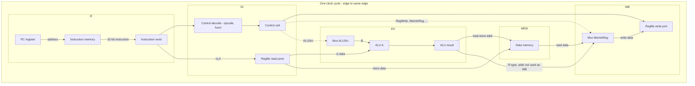

*(PC update: PC+4, branch, or **jump** muxes are omitted here for clarity; see **§9.2** (PC next-value) below.)*

**Narrower view — critical path for `lw` (longest):**

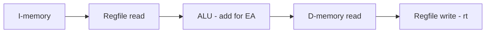

---

### 9.2 PC next-value logic: sequential, branch, jump

**Idea:** `PC+4` is default; if **`beq`** and **Zero**, take **branch target**; if **`j`/`jal`**, take **Jump** target. Priority is typically **Jump** over **Branch** in combined mux chains (one instruction at a time).

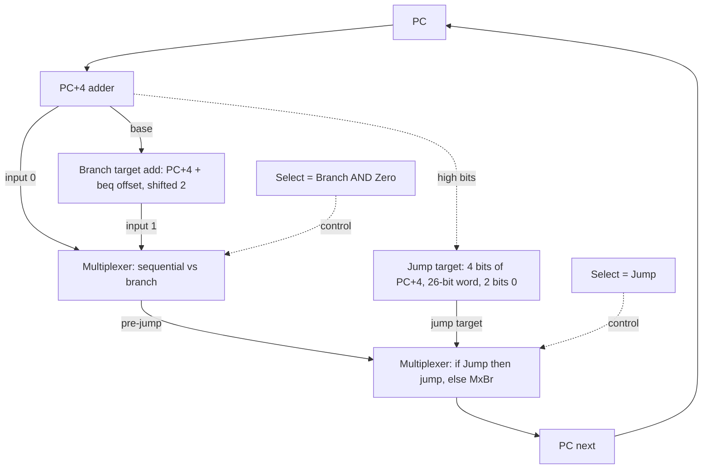

*Separately, **ALU** does **R[rs]−R[rt]** and **Zero** for equality on **`beq`**; **SelBr** comes from that and from main control (Branch=1 for `beq`). **SelJ** is one for **`j`/`jal` only**.*

---

### 9.3 Five-stage pipeline: time-multiplexed path with pipeline registers

**Idea:** Same functional resources as the single-cycle design, but **latches** (IF/ID, ID/EX, EX/MEM, MEM/WB) cut timing into **five** shorter cycles. **T_pipe ≈ max(stage delay)**; throughput approaches **1 IPC** when the pipe is full and hazards are absent.

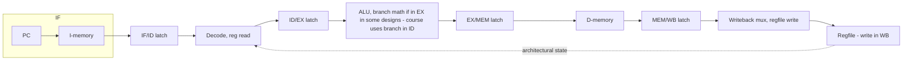

**Pipeline registers (what moves each boundary):**

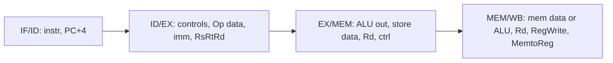

---

### 9.4 Data forwarding (bypass) to the EX stage

**Idea:** For **RAW** on adjacent instructions, the consumer’s **ALU** inputs are muxed from **EX/MEM** (result just finished **EX**) or **MEM/WB** (value after **MEM** for load) instead of the stale regfile read in **ID/EX**.

**Priority when both match the same `Rd`:** use **EX/MEM** (younger producer) over **MEM/WB** (Lect06 **revised** rule).

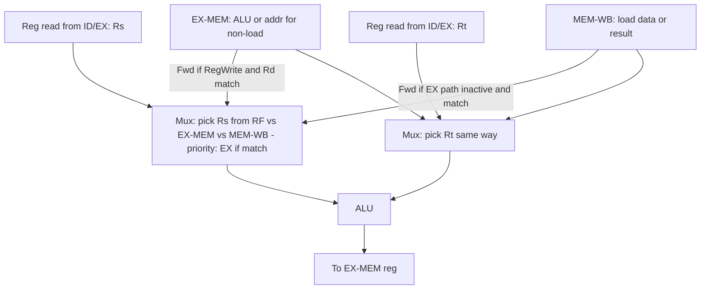

*(**Priority (Lect06):** if both **EX/MEM** and **MEM/WB** match a source register, the mux must take **EX/MEM** / younger producer.)*

**Forward to ID (branch in this course):** the **branch comparator** in **ID** can take muxed inputs from **EX/MEM** and **MEM/WB** (paths **I** and **II** in the discussion matrix).

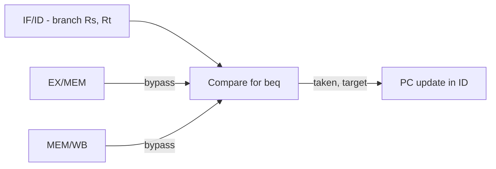

---

### 9.5 Load–use hazard: detection and 1-cycle stall

**Idea:** Load data exists **after MEM**; the **next** instruction cannot get it at **EX** in the same schedule without a **bubble**. **Hazard** when `ID/EX.MemRead` and `ID/EX.Rt` equals `IF/ID.Rs` or `IF/ID.Rt`. **Stall** PC and IF/ID; insert **nop** in **ID/EX**.

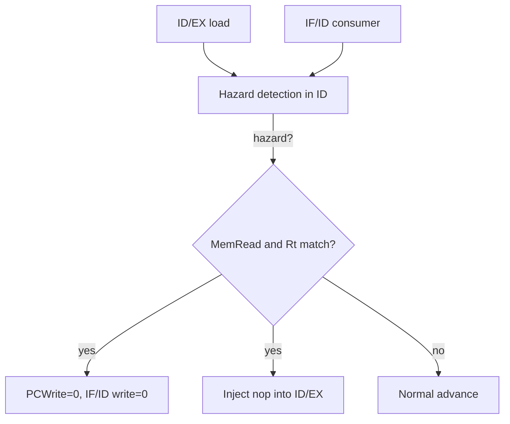

**Pipeline-time sketch (cycle-by-cycle grids are better in slides; here: two lines of text nodes):**

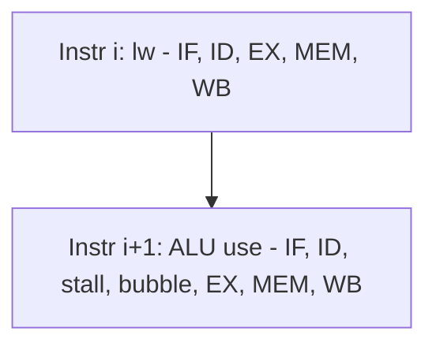

*(Use the course **space–time** diagrams in the PDF for exact cycle alignment.)*

---

### 9.6 Control hazard: branch in ID, fall-through, then flush

**Idea:** IF may have fetched the **not-taken** path; if **taken**, instructions **after** the branch in the **fetch/decode** pipe are **wrong path** and must be **flushed** (squash IF/ID or replace with nops) once the branch **resolves in ID**.

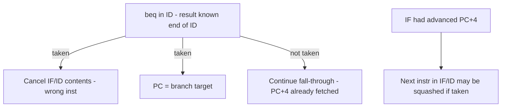

---

### 9.7 Memory hierarchy: logical pyramid and traffic on miss

**Idea:** **Smaller, faster** levels hold **working sets** copied from **larger, slower** levels. On **miss**, a **block (line)** is moved up; **off-chip** (DRAM) and **storage** are last.

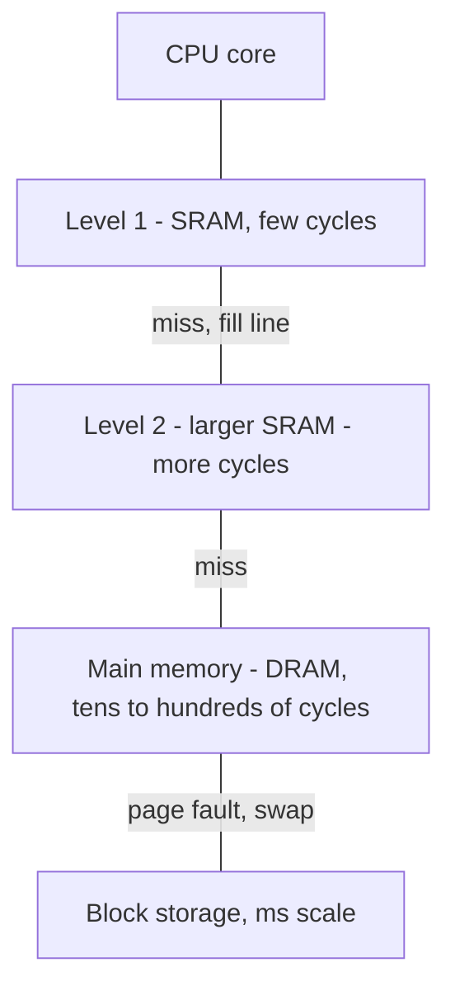

**AMAT (one level), abstract:**

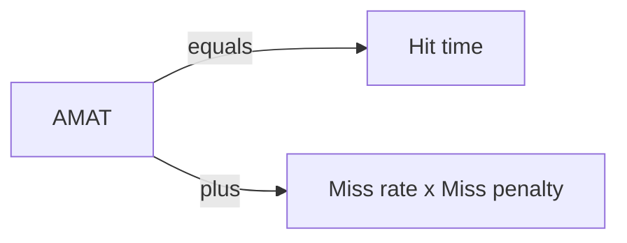

---

### 9.8 Direct-mapped cache: index, tag, valid, and compare

**Idea:** **Index** (low bits of block address) picks **one line**; **tag** (high part) tells **which** memory block; **valid** if line is meaningful.

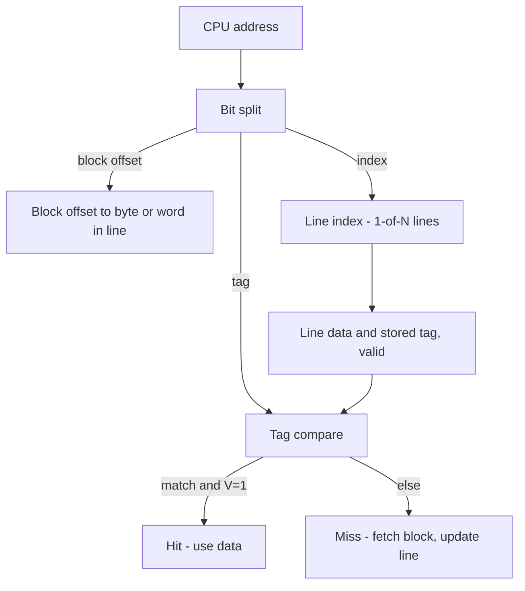

**Set-associative (n-way):** same **index** selects a **set**; **n** parallel (tag, data) entries; **replace** (LRU, random) on miss when set is full.

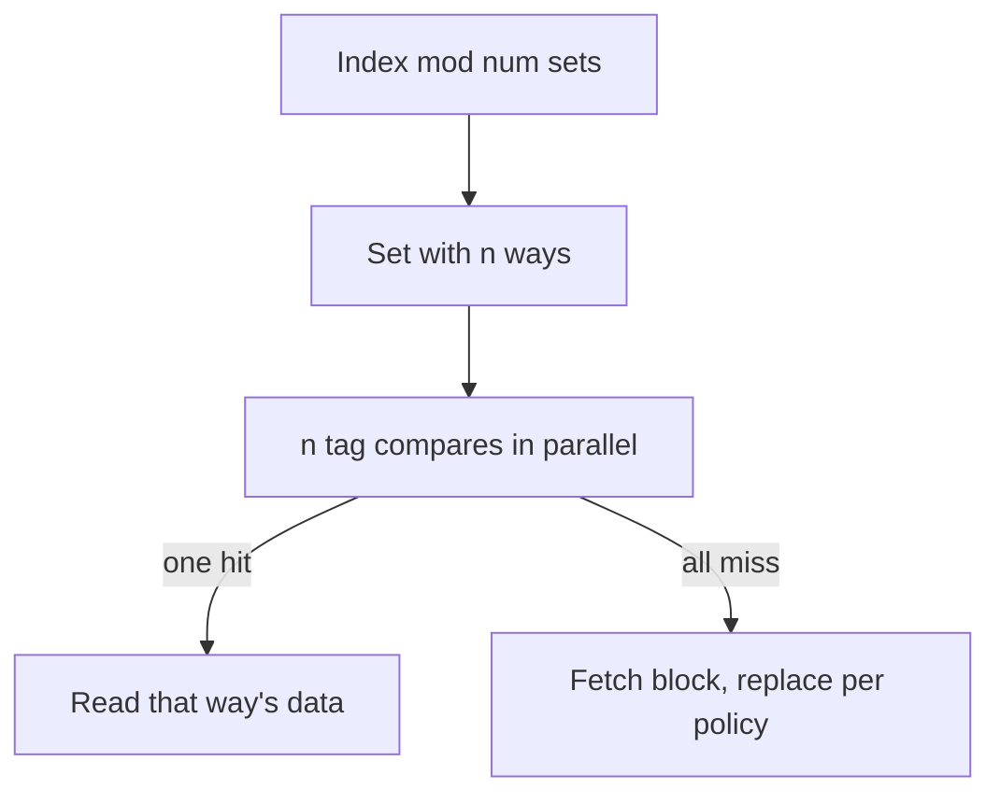

---

### 9.9 Write policies (conceptual)

**Hit: write-through vs write-back; miss: write-allocate vs no-write-allocate**

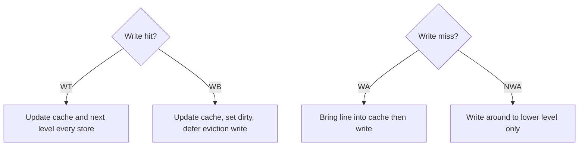

---

### 9.10 Virtual memory, TLB, and VIPT L1 (conceptual)

**Idea:** **VPN + offset** → (via **page table** or **TLB**) **PFN + offset** = **PA**. **VIPT** L1: **index** with **untranslated** page-offset bits (same in VA and **PA**); **tag** **physical** after **TLB**.

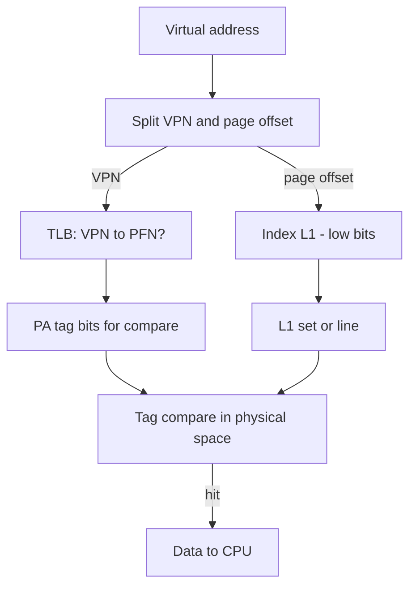

---

### 9.11 Two-bit dynamic branch predictor (saturating)

**Idea:** Four states; **MSB** often encodes **predict T vs NT**; misprediction nudges the counter, **hysteresis** against noise.

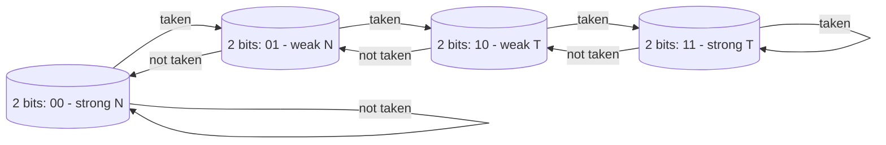

*Convention (common): many slides use the **MSB** as the prediction bit (**N** in **s00, s01**; **T** in **s10, s11**).*

---

### 9.12 Branch target buffer (BTB) in fetch path (conceptual)

**Idea:** In parallel with **I-memory** lookup, **key BTB** with **PC**; on **hit** and **predicted taken**, use **table’s target PC** as next fetch; **mispredict** flushes and **restarts** with correct **PC** and may **update** table.

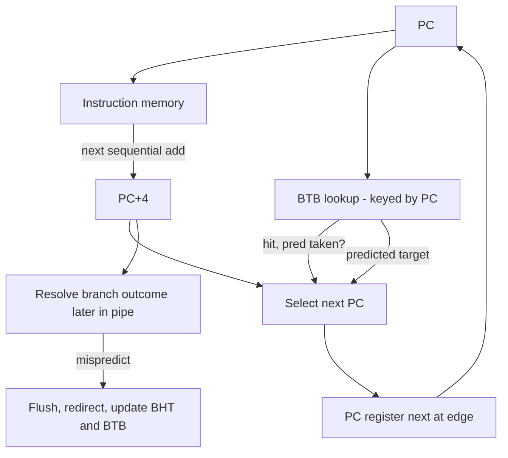

*(BTB and **BHT** are distinct structures: **direction** vs **target**.)*

---

### 9.13 “Putting together” global vs local history (simplified)

**Idea:** **Local** = history **per** branch PC. **Global** = **GHR** of recent outcomes for **all** branches; may **XOR** with **PC** bits (**gshare**) to index a **pattern table**. **Tournament** = **meta**-predictor picks **local** vs **global** component.

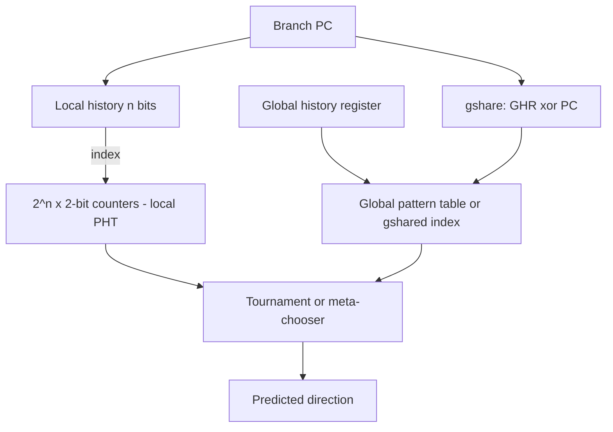

---

### 9.14 Multilevel cache: L1 miss penalty as seen by the CPU (L2 example)

**Idea:** When **L1** misses, the cost is **L2 hit time** plus **L2**’s **local miss rate** times the **cost to the next** level (e.g. main memory), as in the **1-way vs 2-way** L2 design comparison on the course slides.

```mermaid
flowchart TB
  L1miss[L1 miss] --> L2acc[Access L2]
  L2acc -->|hit, time T_L2hit| L2hit[Return line to L1, CPU resumes]
  L2acc -->|miss, prob p_L2miss| DMem2[Access main memory, time T_mem]
  DMem2 --> Fill2[Install line in L2, then L1, CPU resumes]
  EffPen[Expected extra cycles to resolve L1 miss, beyond L1 hit time, often modeled as: T_L2hit + p_L2miss x T_to_memory]
  L1miss -.->|accounts for| EffPen
```

*Always match the **problem statement**: whether “miss penalty” **includes** L2 hit time or is **additive** as above.*

---

### 9.15 M-format / MR memory operands (from discussion, conceptual)

**Idea:** Registers hold **pointers**; **true** dep may need **value equality** of **addresses** in register **contents**, not only **register number** match.

```mermaid
flowchart TB
  RegP[Reg Rs = ptr p, Rt = ptr q, Rd = ptr r]
  RegP --> EXM[EX: read *p, *q, compute]
  EXM --> MEMM[MEM: *r = result]
  Cons[Later instr reads *r, *s] --> AddrEq{Same address as prior write?}
  AddrEq -->|value match| FwdM[EX/MEM bypass or use memory]
```

---

*These diagrams are study aids. For **exact** field widths (TLB, L1, Example II) and **pipeline cycle charts**, use the **worked numeric and prose** material in **§5–6** and any **field sizes** given **on the exam problem**.*
---

## 10. Master checklist (Lectures 4–8 + discussions)

- **L4:** datapath, control, ALU, `beq`/`j` math, **critical path = load**, split I/D.  
- **L5:** stages, **T_c** model, 3 hazards, forward vs load–use, **predict** intro.  
- **L6:** latches, load path, **EX/MEM vs MEM/WB** conditions, **double hazard priority**.  
- **L7:** load **detection/stall** formula, data vs **control**, Case **I–III**, **2-bit**, **BTB**, **tournament** names, **gshare**/**gselect**.  
- **L8:** locality, direct/n-way, 3C, **AMAT/CPI/stores**, unified/split numbers, L2 1/2 way, VIPT/TLB, paging story + optional **segmentation** note, PIM, **write buffer** hazard example.  
- **Discussions:** shift/mult, TIMS, **matrix** cases, **M/MR** alias.  
- **Mermaid (§9):** use for **structural** review of datapath, pipe, cache, **BTB**/**2-bit** flow.

---

## 11. Appendix — textbook alignment, high-yield bullets, and per-lecture exam checklists

This appendix **condenses** what appears in **§2–8** into **checklists** and adds **Hennessy & Patterson** section names for optional reading alongside this file.

### 11.1 Hennessy & Patterson (optional textbook alignment by lecture)

| Lecture (this doc) | H&P reading (edition labels vary) |
|----------------------|-------------------------------------|
| **§2** — Lecture 4 | Ch. **III**, **III.I–III.IV** — addressing, single-cycle datapath, control, critical path |
| **§3** — Lecture 5 | Ch. **IV**, **IV.IV**, **IV.V** — five-stage pipe, speedup, hazards, branch intro |
| **§4** — Lecture 6 | Ch. **IV**, **§4.6** / **IV.VI** — pipelined datapath, forwarding, double hazard |
| **§5** — Lecture 7 | Ch. **IV** — branch prediction, **2-bit** **BHT**, **BTB** (some slides label **IV.IIX**; use your book’s Ch. 4 branch section) |
| **§6** — Lecture 8 | Ch. **5** — “Large and Fast: Exploiting Memory Hierarchy” |
| Lectures **1–3** (not in this document) | Early ISA / intro — use your class notes if exams include that scope; **§7 F.4** TIMS vs MIPS is still covered here |

**Discussion handouts vs lecture material in *this file*:** Discussion IV (TIMS) ↔ **§2** + **§7**; forwarding handout ↔ **§4–5** and **§7 F.5**; M/MR handout ↔ **§4–5** and **§7 F.6**.

### 11.2 High-yield topics (condensed checklist; same ideas as §2–6)

**Single-cycle datapath and control (Lect04)** — Instruction **lifecycle** (fetch → decode/operands → execute/address → memory if load/store → writeback / PC update). **R-type**, **I-type** (load/store/branch) field layouts; sign-extension and use of `offset` in loads/stores; **branch** target: PC+4 + (sign-ext, shift-2) displacement. **j**-type: top 4 bits of PC+4, 26-bit word address, two low bits 0; extra control for jump vs branch. **ALU control** and **ALUOp** from opcode + (for R-type) `funct`. **Main control** signals as a function of opcode (e.g. RegDst, RegWrite, ALUSrc, MemRead, MemWrite, MemtoReg, Branch). **Critical path** argument (e.g. load: I-mem → regfile → ALU → D-mem → regfile) and how it sets single-cycle **clock period**. Hardware building blocks: **mux**, **ALU**, **D flip-flops**, **clocking discipline**; separate I-mem and D-mem in the full datapath; putting R-type, load/store, and branch on one diagram.

**Pipelining (Lect05–Lect07)** — **CPI** vs **latency**; pipelined **throughput** and **clock period** set by the slowest stage; **speedup** when stages balance and the pipe stays full; ideal speedup ∼ number of stages. **MIPS and ISA** features that make pipelining easier (fixed 32-bit instructions, few formats, load/store, alignment). **Hazards:** **structural** (shared single-ported memory: IF vs load/store), **data** (RAW and forwarding), **control** (PC depends on earlier instruction). **Forwarding (bypassing):** use EX/MEM and MEM/WB results before WB; need **RegWrite** and `Rd ≠ $0`; **EX** vs **MEM** path and **double hazard** (priority: prefer **EX** over MEM for same `Rd` — revised MEM conditions in Lect06). **Load-use:** cannot get load data at EX in time for the next instruction; **1-cycle stall** + hazard detection in ID; pipeline front-end (PC, IF/ID) frozen; **ID/EX** squashed to bubble. **Code scheduling** to hide load-use stalls (independent work between load and consumer). **Control hazards** with **branch in ID:** wrong-path fetches, flush/ignore instructions; may need **forwarding to ID** for branch operands; special cases: **R-type** at distance 1/2, **load** at distance 1 or 2 to branch (0/1/2 cycle stalls as in slides). **Static prediction** (e.g. backward taken / forward not taken) vs **dynamic**; **2-bit** counter FSM; **BTB** (index by PC, supply predicted next PC, fixup on mispredict).

**Memory hierarchy (Lect08)** — **Locality** (temporal, spatial) and the **small/fast vs large/slow** tradeoff; typical stack (registers → L1 → L2 → … → DRAM → storage). **Block (line)**, **hit** / **miss**, **miss penalty**, **hit rate** / **miss rate**. **Direct-mapped** placement: (block address) mod (#blocks); **tag** + **index** + **offset**; **valid** bit. **Associativity:** fully associative vs **n-way set associative**; **replacement** (LRU, random); how tag compare scales. **Block size** tradeoff (spatial locality vs conflict, higher miss penalty). **Write policies:** **write-through** vs **write-back**; **write allocate** vs **no write** on miss; effect on **memory bandwidth** and **CPI** (e.g. store frequency × memory write cost); write **buffer** idea. **Performance:** `Execution time = (CPU cycles + memory stall cycles) × T`; memory stalls = f(misses per instruction, miss penalty); **AMAT** = hit time + miss rate × miss penalty. **3Cs:** compulsory, capacity, conflict (and **aliasing** in direct-mapped); **unified** vs **split** I/D caches (weighted AMAT / CPI-style examples in slides). **Multilevel:** L1 local miss rate and **hit/miss time**; effective **L1 miss penalty** to next level, e.g. \(T_{\text{L1 miss}} = T_{\text{L2 hit}} + \text{L2\_miss\_rate} \times T_{\text{L2 miss}}\) (as in 1-way vs 2-way L2 example). **Virtual memory:** VPN + offset; **page table** in memory; **page fault**; **TLB** caching translations; **VIPT** (index with page-offset bits shared by VA/PA, tag in physical space); “putting it together” with L1 tag/index/offset and TLB fields. **Near-memory processing** (awareness: motivation, bandwidth/latency/energy; in- vs near-memory — conceptual).

### 11.3 Per-lecture exam checklists

**Lecture 4** (**§2**)

1. **Draw or trace** the **data path** for `add`, `lw`, `sw`, `beq`, `j` (where the bits go, which mux selects what).  
2. **Compute** `beq` and **`j` targets** from **PC and instruction word** (word vs byte, sign-extend, shift).  
3. **Fill a control** row: `RegDst, ALUSrc, MemtoReg, RegWrite, MemRead, MemWrite, Branch, ALUOp, Jump` for a given `opcode`.  
4. **ALU control:** given **`opcode` + `funct`**, give **3–4** ALU control bits.  
5. **Explain** why **I-mem and D-mem** are **split**; why **one clock** must cover **load** critical path.  
6. **Short answer:** **combinational vs sequential**, **edge-triggering**, what **hold time/setup** is about (implied by clocking slide).

**Lecture 5** (**§3**)

1. **Name and role** of **IF / ID / EX / MEM / WB**.  
2. Why **\(T_{c,\text{pipe}}\)** = **max(stage delays)**, while **single-cycle** \(T_c\) = **sum** of all phases for the worst instruction.  
3. **Throughput ↑**, **single-instruction latency** not magically ↓; ideal speedup needs **balance** + **full pipe**.  
4. **MIPS ISA** features that ease pipelining: **fixed 32-bit** instructions, **regular formats**, **load/store**, **alignment**.  
5. **Three hazards:** structural, data, control—each with a **concrete MIPS** story.  
6. **Forwarding:** fixes many RAW hazards **except** classic **load–use**.  
7. **Load–use:** needs **stall** or **scheduling**; **cannot violate causality** (“no backward forwarding in time”).  
8. **Control:** branch **stall** vs **prediction** (predict not taken as the baseline example); **static vs dynamic** taxonomy.

**Lecture 6** (**§4**)

1. **Name** the four **pipeline registers** and **what** each holds for a **R-type** and a **`lw`**.  
2. **Explain** why a **load**’s data is **not** at the **EX** output for the **next** instruction in the same way as an `add`’s.  
3. **State** the **EX/MEM** and **MEM/WB** forwarding **conditions** including **RegWrite** and `Rd`.  
4. **State** the **revised** rule: if **both** could forward the **same** architected register, **EX/MEM wins**; write the **negated EX/MEM** term in the **MEM/WB** condition.  
5. **Draw** (or **interpret**) **two** **RAW**s on **`add`**, one from **i−1** in EX/MEM and one from **i−2** in MEM/WB, and which muxes activate.

**Lecture 7** — full list in **§5.14** above (includes local / **GHR** / **gshare** names).

**Lecture 8** (**§6**)

- Trace **direct-mapped** and **set-associative** accesses; compute **index/tag/offset**.  
- **AMAT** and **CPI** with **stores** and **write-through**; **unified** vs **split** weighted formulas.  
- **L1** **effective** miss **penalty** with **L2** **hit** time and **local** L2 **miss** rate to **main**.  
- **3Cs**; **VIPT** definition and the **index**-within-page **constraint**.  
- **TLB** role; **order** of **TLB** + **L1** access in **Example II** (conceptual from diagram).  
- **PIM** motivation + **taxonomy** names (BPO, CPO, programmable).

---

*You can prepare for exams on **Lectures 4–8** and the **discussion** topics in **§7** using **only** this document: master the definitions and procedures in **§1–8**, use **§9** for visual structure, then **§10–11** to verify you can recall and apply each skill.*

*End of consolidated reference.*
