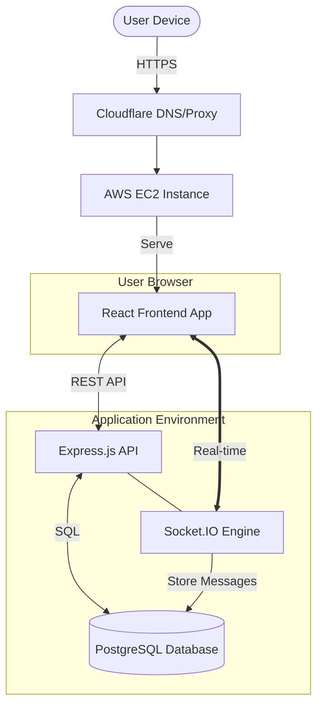

# [outfitexplorer.com](http://outfitexplorer.com/)
A full-stack web app to save, organize, and share outfits from your wardrobe.
Started Mar 4, 2025.

<p align="center">

</p>

## About the Project

Outfit Explorer lets you catalog your clothing items, build outfits by combining pieces into slots, and keep everything organized in one place. Upload photos of your clothes, tag them by category, and mix and match them into saved outfits.

Outfit Explorer also lets you connect with friends. Search for other users, send and accept friend requests, send messages, and build your own social network within the app. Easily view your friends' profiles and share outfit ideas.

## Features

- **User authentication** — secure, stateless registration and login utilizing bcrypt password hashing and JWT tokens.

- **Friend Management** — search for users, send and accept friend requests, and manage your friends list easily within the app.

- **API Response Caching** — integrated TanStack React Query to establish a global frontend cache layer, eliminating redundant API calls and delivering app navigation with minimal loading time.

- **Intelligent Image Classification** — integrated TensorFlow with the MobileNet model to automatically suggest item categories (Tops, Bottoms, Shoes, Accessories) based on user-uploaded images.

- **Scalable Clothing Management** — dynamic image uploading with interactive canvas cropping and compression, allowing users to efficiently organize and categorize clothing data.

- **RESTful API** — Express.js server with TypeScript, modular routing, and parameterized SQL queries.

- **Real-time Messaging** — integrated Socket.IO with JWT authentication to provide instant, real-time messaging between friends.

- **Automated Testing** — comprehensive unit and integration test suite using Vitest and Supertest

## Technologies Used

| Layer    | Stack                           |
| -------- | ------------------------------- |
| Frontend | React, TypeScript, Tailwind CSS, TensorFlow.js, TanStack Query |
| Server   | Node.js, Express.js, TypeScript, Socket.IO |
| Testing  | Vitest, Supertest              |
| Database | PostgreSQL                      |
| Infra    | AWS EC2, Docker, Cloudflare         |



## Development & Deployment

**[Database Relationship Diagram](https://github.com/carlgombert/WardrobeOrganizer/blob/main/documentation/database.md)**

### 1. Local Development


**A. Start the Database**
From the `server/` directory:
```bash
docker compose up -d db
```

**B. Start the Backend**
From the `server/` directory:
```bash
npm install
npm run dev
```
Server runs at `http://localhost:3000/api`

**C. Start the Frontend**
From the `client/` directory:
```bash
npm install
npm run dev
```
Frontend runs at `http://localhost:5173` with Vite HMR.

---

### 2. Production / EC2 Deployment
Build the frontend and Docker image locally, push to a registry, and pull on the server to avoid builds on EC2.

**A. On your local machine:**
```bash
./build-local.sh
```
Compiles frontend assets and builds a `linux/amd64` Docker image.

**B. On your EC2 Instance:**
```bash
git pull
./deploy.sh
```
Pulls the latest image and restarts the app on Port 80.

---

### Testing

To run the backend test suite, navigate to the `server/` directory and run:

```bash
cd server
npm run test:run      # Run suite
npm run test:coverage # View statistics
```
